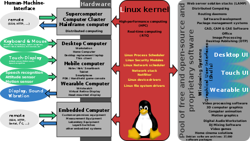

<p><strong>Linux</strong>&nbsp;is a family of&nbsp;<a title="Free and open-source software" href="https://en.wikipedia.org/wiki/Free_and_open-source_software">open source</a>&nbsp;<a title="Unix-like" href="https://en.wikipedia.org/wiki/Unix-like">Unix-like</a>&nbsp;<a title="Operating system" href="https://en.wikipedia.org/wiki/Operating_system">operating systems</a>&nbsp;based on the&nbsp;<a title="Linux kernel" href="https://en.wikipedia.org/wiki/Linux_kernel">Linux kernel</a>,&nbsp;an&nbsp;<a class="mw-redirect" title="Kernel (computing)" href="https://en.wikipedia.org/wiki/Kernel_(computing)">operating system kernel</a>&nbsp;first released on September 17, 1991, by&nbsp;<a title="Linus Torvalds" href="https://en.wikipedia.org/wiki/Linus_Torvalds">Linus Torvalds</a>.&nbsp;Linux is typically&nbsp;<a title="Package manager" href="https://en.wikipedia.org/wiki/Package_manager">packaged</a>&nbsp;in a&nbsp;<a title="" href="https://en.wikipedia.org/wiki/Linux_distribution">Linux distribution</a>.</p>
<p>Distributions include the Linux kernel and supporting&nbsp;<a title="System software" href="https://en.wikipedia.org/wiki/System_software">system software</a>&nbsp;and&nbsp;<a class="mw-redirect" title="Library (computer science)" href="https://en.wikipedia.org/wiki/Library_(computer_science)">libraries</a>, many of which are provided by the&nbsp;<a title="GNU Project" href="https://en.wikipedia.org/wiki/GNU_Project">GNU Project</a>. Many Linux distributions use the word "Linux" in their name, but the&nbsp;<a title="Free Software Foundation" href="https://en.wikipedia.org/wiki/Free_Software_Foundation">Free Software Foundation</a>&nbsp;uses the name&nbsp;<em><a title="GNU" href="https://en.wikipedia.org/wiki/GNU">GNU</a>/Linux</em>&nbsp;to emphasize the importance of GNU software, causing some&nbsp;<a title="GNU/Linux naming controversy" href="https://en.wikipedia.org/wiki/GNU/Linux_naming_controversy">controversy</a>.</p>
<p>Popular Linux distributions&nbsp;include&nbsp;<a title="Debian" href="https://en.wikipedia.org/wiki/Debian">Debian</a>,&nbsp;<a title="Fedora (operating system)" href="https://en.wikipedia.org/wiki/Fedora_(operating_system)">Fedora</a>, and&nbsp;<a class="mw-redirect" title="Ubuntu (operating system)" href="https://en.wikipedia.org/wiki/Ubuntu_(operating_system)">Ubuntu</a>. Commercial distributions include&nbsp;<a title="Red Hat Enterprise Linux" href="https://en.wikipedia.org/wiki/Red_Hat_Enterprise_Linux">Red Hat Enterprise Linux</a>&nbsp;and&nbsp;<a class="mw-redirect" title="SUSE Linux Enterprise Server" href="https://en.wikipedia.org/wiki/SUSE_Linux_Enterprise_Server">SUSE Linux Enterprise Server</a>. Desktop Linux distributions include a&nbsp;<a title="Windowing system" href="https://en.wikipedia.org/wiki/Windowing_system">windowing system</a>&nbsp;such as&nbsp;<a class="mw-redirect" title="X11" href="https://en.wikipedia.org/wiki/X11">X11</a>&nbsp;or&nbsp;<a title="Wayland (display server protocol)" href="https://en.wikipedia.org/wiki/Wayland_(display_server_protocol)">Wayland</a>, and a&nbsp;<a title="Desktop environment" href="https://en.wikipedia.org/wiki/Desktop_environment">desktop environment</a>&nbsp;such as&nbsp;<a title="GNOME" href="https://en.wikipedia.org/wiki/GNOME">GNOME</a>&nbsp;or&nbsp;<a class="mw-redirect" title="KDE Plasma" href="https://en.wikipedia.org/wiki/KDE_Plasma">KDE Plasma</a>. Distributions intended for&nbsp;<a title="Server (computing)" href="https://en.wikipedia.org/wiki/Server_(computing)">servers</a>&nbsp;may omit&nbsp;<a title="Computer graphics" href="https://en.wikipedia.org/wiki/Computer_graphics">graphics</a>&nbsp;altogether, or include a&nbsp;<a title="Solution stack" href="https://en.wikipedia.org/wiki/Solution_stack">solution stack</a>&nbsp;such as&nbsp;<a title="LAMP (software bundle)" href="https://en.wikipedia.org/wiki/LAMP_(software_bundle)">LAMP</a>. Because Linux is freely redistributable, anyone may create a distribution for any purpose.</p>
<p>Linux was originally developed for&nbsp;<a title="Personal computer" href="https://en.wikipedia.org/wiki/Personal_computer">personal computers</a>&nbsp;based on the&nbsp;<a class="mw-redirect" title="Intel x86" href="https://en.wikipedia.org/wiki/Intel_x86">Intel x86</a>&nbsp;architecture, but has since been&nbsp;<a title="Porting" href="https://en.wikipedia.org/wiki/Porting">ported</a>&nbsp;to more&nbsp;<a class="mw-redirect" title="Computer hardware platforms" href="https://en.wikipedia.org/wiki/Computer_hardware_platforms">platforms</a>&nbsp;than any other operating system.&nbsp;Linux is the leading operating system on&nbsp;<a title="Server (computing)" href="https://en.wikipedia.org/wiki/Server_(computing)">servers</a>&nbsp;and other&nbsp;<a class="mw-redirect" title="Big iron (computing)" href="https://en.wikipedia.org/wiki/Big_iron_(computing)">big iron</a>&nbsp;systems such as&nbsp;<a title="Mainframe computer" href="https://en.wikipedia.org/wiki/Mainframe_computer">mainframe computers</a>, and the only OS used on&nbsp;<a title="TOP500" href="https://en.wikipedia.org/wiki/TOP500">TOP500</a>&nbsp;<a title="Supercomputer" href="https://en.wikipedia.org/wiki/Supercomputer">supercomputers</a>&nbsp;(since November 2017, having gradually eliminated all competitors).&nbsp;It is used by around 2.3 percent of&nbsp;<a title="Desktop computer" href="https://en.wikipedia.org/wiki/Desktop_computer">desktop computers</a>.&nbsp;The&nbsp;<a title="Chromebook" href="https://en.wikipedia.org/wiki/Chromebook">Chromebook</a>, which runs the Linux kernel-based&nbsp;<a title="Chrome OS" href="https://en.wikipedia.org/wiki/Chrome_OS">Chrome OS</a>, dominates the US&nbsp;<a title="K&ndash;12" href="https://en.wikipedia.org/wiki/K%E2%80%9312">K&ndash;12</a>&nbsp;education market and represents nearly 20 percent of sub-$300&nbsp;<a title="Laptop" href="https://en.wikipedia.org/wiki/Laptop">notebook</a>&nbsp;sales in the US.</p>
<p>Linux also runs on&nbsp;<a title="Embedded system" href="https://en.wikipedia.org/wiki/Embedded_system">embedded systems</a>, i.e. devices whose&nbsp;<a title="Operating system" href="https://en.wikipedia.org/wiki/Operating_system">operating system</a>&nbsp;is typically built into the&nbsp;<a title="Firmware" href="https://en.wikipedia.org/wiki/Firmware">firmware</a>&nbsp;and is highly tailored to the system. This includes&nbsp;<a title="Router (computing)" href="https://en.wikipedia.org/wiki/Router_(computing)">routers</a>,&nbsp;<a title="Automation" href="https://en.wikipedia.org/wiki/Automation">automation</a>&nbsp;controls,&nbsp;<a title="Television" href="https://en.wikipedia.org/wiki/Television">televisions</a>,&nbsp;<a title="Digital video recorder" href="https://en.wikipedia.org/wiki/Digital_video_recorder">digital video recorders</a>,&nbsp;<a title="Video game console" href="https://en.wikipedia.org/wiki/Video_game_console">video game consoles</a>, and&nbsp;<a title="Smartwatch" href="https://en.wikipedia.org/wiki/Smartwatch">smartwatches</a>.&nbsp;Many smartphones and&nbsp;<a title="Tablet computer" href="https://en.wikipedia.org/wiki/Tablet_computer">tablet computers</a>&nbsp;run&nbsp;<a title="Android (operating system)" href="https://en.wikipedia.org/wiki/Android_(operating_system)">Android</a>&nbsp;and other Linux derivatives.&nbsp;Because of the dominance of Android on&nbsp;<a title="Smartphone" href="https://en.wikipedia.org/wiki/Smartphone">smartphones</a>, Linux has the&nbsp;<a title="Usage share of operating systems" href="https://en.wikipedia.org/wiki/Usage_share_of_operating_systems">largest</a>&nbsp;<a title="Installed base" href="https://en.wikipedia.org/wiki/Installed_base">installed base</a>&nbsp;of all&nbsp;<a class="mw-redirect" title="General-purpose operating system" href="https://en.wikipedia.org/wiki/General-purpose_operating_system">general-purpose operating systems</a>.</p>
<p>Linux is one of the most prominent examples of free and open-source&nbsp;<a title="Software" href="https://en.wikipedia.org/wiki/Software">software</a>&nbsp;collaboration. The&nbsp;<a title="Source code" href="https://en.wikipedia.org/wiki/Source_code">source code</a>&nbsp;may be used, modified and distributed&mdash;commercially or non-commercially&mdash;by anyone under the terms of its respective licenses, such as the&nbsp;<a title="GNU General Public License" href="https://en.wikipedia.org/wiki/GNU_General_Public_License">GNU General Public License</a>.</p>


</br>


<table class="infobox vevent">
<tbody>
<tr>
<td colspan="2"><a class="image" title="Tux the penguin" href="Tux.png" srcset="Tux.png" alt="Tux the penguin" width="150" height="177" data-file-width="280" data-file-height="330" /></a>
<div><a title="Tux (mascot)" href="https://en.wikipedia.org/wiki/Tux_(mascot)">Tux</a>&nbsp;the&nbsp;<a title="Penguin" href="https://en.wikipedia.org/wiki/Penguin">penguin</a>, mascot of Linux</div>
</td>
</tr>
<tr>
<th scope="row"><a class="mw-redirect" title="Software developer" href="https://en.wikipedia.org/wiki/Software_developer">Developer</a></th>
<td>Community<br /><a title="Linus Torvalds" href="https://en.wikipedia.org/wiki/Linus_Torvalds">Linus Torvalds</a></td>
</tr>
<tr>
<th scope="row"><a title="Programming language" href="https://en.wikipedia.org/wiki/Programming_language">Written in</a></th>
<td><a title="C (programming language)" href="https://en.wikipedia.org/wiki/C_(programming_language)">C</a>, assembler</td>
</tr>
<tr>
<th scope="row">OS family</th>
<td><a title="Unix-like" href="https://en.wikipedia.org/wiki/Unix-like">Unix-like</a></td>
</tr>
<tr>
<th scope="row">Working state</th>
<td>Current</td>
</tr>
<tr>
<th scope="row">Source model</th>
<td><a title="Open-source software" href="https://en.wikipedia.org/wiki/Open-source_software">Open source</a></td>
</tr>
<tr>
<th scope="row">Initial release</th>
<td>September&nbsp;17, 1991<span class="noprint">; 28 years ago</span></td>
</tr>
<tr>
<th scope="row">Marketing target</th>
<td><a title="Cloud computing" href="https://en.wikipedia.org/wiki/Cloud_computing">Cloud computing</a>,&nbsp;<a class="mw-redirect" title="Embedded device" href="https://en.wikipedia.org/wiki/Embedded_device">embedded devices</a>,&nbsp;<a title="Mainframe computer" href="https://en.wikipedia.org/wiki/Mainframe_computer">mainframe computers</a>,&nbsp;<a title="Mobile device" href="https://en.wikipedia.org/wiki/Mobile_device">mobile devices</a>,&nbsp;<a title="Personal computer" href="https://en.wikipedia.org/wiki/Personal_computer">personal computers</a>,&nbsp;<a title="Server (computing)" href="https://en.wikipedia.org/wiki/Server_(computing)">servers</a>,&nbsp;<a title="Supercomputer" href="https://en.wikipedia.org/wiki/Supercomputer">supercomputers</a></td>
</tr>
<tr>
<th scope="row"><a title="Natural language" href="https://en.wikipedia.org/wiki/Natural_language">Available in</a></th>
<td>Multilingual</td>
</tr>
<tr>
<th scope="row">Platforms</th>
<td><a title="DEC Alpha" href="https://en.wikipedia.org/wiki/DEC_Alpha">Alpha</a>,&nbsp;<a title="ARC (processor)" href="https://en.wikipedia.org/wiki/ARC_(processor)">ARC</a>,&nbsp;<a title="ARM architecture" href="https://en.wikipedia.org/wiki/ARM_architecture">ARM</a>,&nbsp;<a class="mw-redirect" title="C6x" href="https://en.wikipedia.org/wiki/C6x">C6x</a>,&nbsp;<a class="mw-redirect" title="H8/300" href="https://en.wikipedia.org/wiki/H8/300">H8/300</a>,&nbsp;<a title="Qualcomm Hexagon" href="https://en.wikipedia.org/wiki/Qualcomm_Hexagon">Hexagon</a>,&nbsp;<a title="Itanium" href="https://en.wikipedia.org/wiki/Itanium">Itanium</a>,&nbsp;<a class="mw-redirect" title="M68k" href="https://en.wikipedia.org/wiki/M68k">m68k</a>,&nbsp;<a class="mw-redirect" title="Microblaze" href="https://en.wikipedia.org/wiki/Microblaze">Microblaze</a>,&nbsp;<a title="MIPS architecture" href="https://en.wikipedia.org/wiki/MIPS_architecture">MIPS</a>, NDS32,&nbsp;<a title="Nios II" href="https://en.wikipedia.org/wiki/Nios_II">Nios II</a>,&nbsp;<a title="OpenRISC" href="https://en.wikipedia.org/wiki/OpenRISC">OpenRISC</a>,&nbsp;<a title="PA-RISC" href="https://en.wikipedia.org/wiki/PA-RISC">PA-RISC</a>,&nbsp;<a title="PowerPC" href="https://en.wikipedia.org/wiki/PowerPC">PowerPC</a>,&nbsp;<a title="RISC-V" href="https://en.wikipedia.org/wiki/RISC-V">RISC-V</a>,&nbsp;<a class="mw-redirect" title="S390" href="https://en.wikipedia.org/wiki/S390">s390</a>,&nbsp;<a title="SuperH" href="https://en.wikipedia.org/wiki/SuperH">SuperH</a>,&nbsp;<a title="SPARC" href="https://en.wikipedia.org/wiki/SPARC">SPARC</a>,&nbsp;<a class="mw-redirect" title="Unicore32" href="https://en.wikipedia.org/wiki/Unicore32">Unicore32</a>,&nbsp;<a title="X86" href="https://en.wikipedia.org/wiki/X86">x86</a>,&nbsp;<a class="mw-redirect" title="XBurst" href="https://en.wikipedia.org/wiki/XBurst">XBurst</a>,&nbsp;<a class="mw-redirect" title="Xtensa" href="https://en.wikipedia.org/wiki/Xtensa">Xtensa</a></td>
</tr>
<tr>
<th scope="row"><a title="Kernel (operating system)" href="https://en.wikipedia.org/wiki/Kernel_(operating_system)">Kernel</a>&nbsp;type</th>
<td><a title="Monolithic kernel" href="https://en.wikipedia.org/wiki/Monolithic_kernel">Monolithic</a></td>
</tr>
<tr>
<th scope="row"><a title="User space" href="https://en.wikipedia.org/wiki/User_space#USERLAND">Userland</a></th>
<td><a title="GNU" href="https://en.wikipedia.org/wiki/GNU">GNU</a></td>
</tr>
<tr>
<th scope="row">Default&nbsp;<a title="User interface" href="https://en.wikipedia.org/wiki/User_interface">user interface</a></th>
<td><a title="Unix shell" href="https://en.wikipedia.org/wiki/Unix_shell">Unix shell</a></td>
</tr>
<tr>
<th scope="row"><a title="Software license" href="https://en.wikipedia.org/wiki/Software_license">License</a></th>
<td><a class="mw-redirect" title="GPLv2" href="https://en.wikipedia.org/wiki/GPLv2">GPLv2</a>&nbsp;and others (the name "Linux" is a trademark)</td>
</tr>
<tr>
<th scope="row">Official website</th>
<td><span class="url"><a class="external text" href="https://www.linuxfoundation.org/" rel="nofollow">www<wbr />.linuxfoundation<wbr />.org</a></span></td>
</tr>
</tbody>
</table>

</br>


<div class="toctitle" dir="ltr" lang="en">
<h2 id="mw-toc-heading">Contents</h2>
<label class="toctogglelabel" for="toctogglecheckbox"></label></div>
<ul>
<li class="toclevel-1 tocsection-1"><a href="#History"><span class="toctext">History</span></a>
<ul>
<li class="toclevel-2 tocsection-2"><a href="#Precursors"><span class="toctext">Precursors</span></a></li>
<li class="toclevel-2 tocsection-3"><a href="#Creation"><span class="toctext">Creation</span></a></li>
<li class="toclevel-2 tocsection-4"><a href="#Naming"><span class="toctext">Naming</span></a></li>
<li class="toclevel-2 tocsection-5"><a href="#Commercial_and_popular_uptake"><span class="toctext">Commercial and popular uptake</span></a></li>
<li class="toclevel-2 tocsection-6"><a href="#Current_development"><span class="toctext">Current development</span></a></li>
</ul>
</li>
<li class="toclevel-1 tocsection-7"><a href="#Design"><span class="toctext">Design</span></a>
<ul>
<li class="toclevel-2 tocsection-8"><a href="#User_interface"><span class="toctext">User interface</span></a></li>
<li class="toclevel-2 tocsection-9"><a href="#Video_input_infrastructure"><span class="toctext">Video input infrastructure</span></a></li>
</ul>
</li>
<li class="toclevel-1 tocsection-10"><a href="#Development"><span class="toctext">Development</span></a>
<ul>
<li class="toclevel-2 tocsection-11"><a href="#Community"><span class="toctext">Community</span></a></li>
<li class="toclevel-2 tocsection-12"><a href="#Programming_on_Linux"><span class="toctext">Programming on Linux</span></a></li>
</ul>
</li>
<li class="toclevel-1 tocsection-13"><a href="#Hardware_support"><span class="toctext">Hardware support</span></a></li>
<li class="toclevel-1 tocsection-14"><a href="#Uses"><span class="toctext">Uses</span></a>
<ul>
<li class="toclevel-2 tocsection-15"><a href="#Desktop"><span class="toctext">Desktop</span></a></li>
<li class="toclevel-2 tocsection-18"><a href="#Netbooks"><span class="toctext">Netbooks</span></a></li>
<li class="toclevel-2 tocsection-19"><a href="#Servers,_mainframes_and_supercomputers"><span class="toctext">Servers, mainframes and supercomputers</span></a></li>
<li class="toclevel-2 tocsection-20"><a href="#Smart_devices"><span class="toctext">Smart devices</span></a></li>
<li class="toclevel-2 tocsection-21"><a href="#Embedded_devices"><span class="toctext">Embedded devices</span></a></li>
<li class="toclevel-2 tocsection-22"><a href="#Gaming"><span class="toctext">Gaming</span></a></li>
<li class="toclevel-2 tocsection-23"><a href="#Specialized_uses"><span class="toctext">Specialized uses</span></a></li>
</ul>
</li>
<li class="toclevel-1 tocsection-30"><a href="#Market_share_and_uptake"><span class="toctext">Market share and uptake</span></a></li>
<li class="toclevel-1 tocsection-31"><a href="#Copyright,_trademark,_and_naming"><span class="toctext">Copyright, trademark, and naming</span></a></li>
<li class="toclevel-1 tocsection-32"><a href="#Linux Commands"><span class="toctext">Important Linux Commands You Should Know</span></a></li>  
 <li class="toclevel-1 tocsection-33"><a href="#Books"><span class="toctext">Books</span></a></li> 
</ul>

</br>

<h2><span id="History" class="mw-headline">History</span></h2>
<h3><span id="Precursors" class="mw-headline">Precursors</span></h3>
<div class="thumb tright">
<div class="thumbinner"><a class="image" href="Linus_Torvalds.jpg"></a>
<div class="thumbcaption">
<div class="magnify">&nbsp;</div>
<a title="Linus Torvalds" href="https://en.wikipedia.org/wiki/Linus_Torvalds">Linus Torvalds</a>, principal author of the&nbsp;<a title="Linux kernel" href="https://en.wikipedia.org/wiki/Linux_kernel">Linux kernel</a></div>
<div class="thumbcaption">&nbsp;</div>
</div>
</div>

</br>
<h2>Publications </h2>
<ul>
 <li><a target="_blank" href="https://github.com/manjunath5496/Linux-Tutorial/blob/master/linux(1).pdf" style="text-decoration:none;">Just for Fun: The Story of an Accidental Revolutionary</a></li>
                            
 <li><a target="_blank" href="https://github.com/manjunath5496/Linux-Tutorial/blob/master/linux(2).pdf" style="text-decoration:none;">Linux: a Portable Operating System</a></li>

<li><a target="_blank" href="https://github.com/manjunath5496/Linux-Tutorial/blob/master/linux(3).pdf" style="text-decoration:none;">The Hacker Ethic and the Spirit of the Information Age</a></li>
 <li><a target="_blank" href="https://github.com/manjunath5496/Linux-Tutorial/blob/master/linux(4).pdf" style="text-decoration:none;">N4321: Towards Implementation and Use of memory order consume</a></li>   
 
 </ul>

</br>


<p>The&nbsp;<a title="Unix" href="https://en.wikipedia.org/wiki/Unix">Unix</a>&nbsp;operating system was conceived and implemented in 1969, at&nbsp;<a title="AT&amp;T" href="https://en.wikipedia.org/wiki/AT%26T">AT&amp;T</a>'s&nbsp;<a class="mw-redirect" title="Bell Laboratories" href="https://en.wikipedia.org/wiki/Bell_Laboratories">Bell Laboratories</a>&nbsp;in the United States by&nbsp;<a title="Ken Thompson" href="https://en.wikipedia.org/wiki/Ken_Thompson">Ken Thompson</a>,&nbsp;<a title="Dennis Ritchie" href="https://en.wikipedia.org/wiki/Dennis_Ritchie">Dennis Ritchie</a>,&nbsp;<a title="Douglas McIlroy" href="https://en.wikipedia.org/wiki/Douglas_McIlroy">Douglas McIlroy</a>, and&nbsp;<a title="Joe Ossanna" href="https://en.wikipedia.org/wiki/Joe_Ossanna">Joe Ossanna</a>.&nbsp;First released in 1971, Unix was written entirely in&nbsp;<a title="Assembly language" href="https://en.wikipedia.org/wiki/Assembly_language">assembly language</a>, as was common practice at the time. In 1973 in a key, pioneering approach, it was rewritten in the&nbsp;<a title="C (programming language)" href="https://en.wikipedia.org/wiki/C_(programming_language)">C</a>&nbsp;programming language by&nbsp;<a title="Dennis Ritchie" href="https://en.wikipedia.org/wiki/Dennis_Ritchie">Dennis Ritchie</a>&nbsp;(with the exception of some hardware and I/O routines). The availability of a&nbsp;<a class="mw-redirect" title="High-level language" href="https://en.wikipedia.org/wiki/High-level_language">high-level language</a>&nbsp;implementation of Unix made its&nbsp;<a title="Porting" href="https://en.wikipedia.org/wiki/Porting">porting</a>&nbsp;to different computer platforms easier.</p>
<p>Due to an earlier&nbsp;<a class="mw-redirect" title="Antitrust case" href="https://en.wikipedia.org/wiki/Antitrust_case">antitrust case</a>&nbsp;forbidding it from entering the computer business, AT&amp;T was required to license the operating system's source code to anyone who asked. As a result, Unix grew quickly and became widely adopted by academic institutions and businesses. In 1984, AT&amp;T divested itself of Bell Labs; freed of the legal obligation requiring free licensing, Bell Labs began selling Unix as a&nbsp;<a title="Proprietary software" href="https://en.wikipedia.org/wiki/Proprietary_software">proprietary</a>&nbsp;product, where users were not legally allowed to modify Unix. The&nbsp;<a title="GNU Project" href="https://en.wikipedia.org/wiki/GNU_Project">GNU Project</a>, started in 1983 by&nbsp;<a title="Richard Stallman" href="https://en.wikipedia.org/wiki/Richard_Stallman">Richard Stallman</a>, had the goal of creating a "complete Unix-compatible software system" composed entirely of&nbsp;<a title="Free software" href="https://en.wikipedia.org/wiki/Free_software">free software</a>. Work began in 1984.&nbsp;Later, in 1985, Stallman started the&nbsp;<a title="Free Software Foundation" href="https://en.wikipedia.org/wiki/Free_Software_Foundation">Free Software Foundation</a>&nbsp;and wrote the&nbsp;<a title="GNU General Public License" href="https://en.wikipedia.org/wiki/GNU_General_Public_License">GNU General Public License</a>&nbsp;(GNU GPL) in 1989. By the early 1990s, many of the programs required in an operating system (such as libraries,&nbsp;<a title="Compiler" href="https://en.wikipedia.org/wiki/Compiler">compilers</a>,&nbsp;<a title="Text editor" href="https://en.wikipedia.org/wiki/Text_editor">text editors</a>, a&nbsp;<a title="Unix shell" href="https://en.wikipedia.org/wiki/Unix_shell">Unix shell</a>, and a&nbsp;<a title="Windowing system" href="https://en.wikipedia.org/wiki/Windowing_system">windowing system</a>) were completed, although low-level elements such as&nbsp;<a title="Device driver" href="https://en.wikipedia.org/wiki/Device_driver">device drivers</a>,&nbsp;<a class="mw-redirect" title="Daemon (computer software)" href="https://en.wikipedia.org/wiki/Daemon_(computer_software)">daemons</a>, and the&nbsp;<a class="mw-redirect" title="Kernel (computer science)" href="https://en.wikipedia.org/wiki/Kernel_(computer_science)">kernel</a>, called&nbsp;<a class="mw-redirect" title="GNU/Hurd" href="https://en.wikipedia.org/wiki/GNU/Hurd">GNU/Hurd</a>, were stalled and incomplete.</p>
<p>Linus Torvalds has stated that if the&nbsp;<a class="mw-redirect" title="GNU kernel" href="https://en.wikipedia.org/wiki/GNU_kernel">GNU kernel</a>&nbsp;had been available at the time (1991), he would not have decided to write his own.&nbsp;Although not released until 1992, due to&nbsp;<a class="mw-redirect" title="Net/2" href="https://en.wikipedia.org/wiki/Net/2">legal complications</a>, development of&nbsp;<a title="386BSD" href="https://en.wikipedia.org/wiki/386BSD">386BSD</a>, from which&nbsp;<a title="NetBSD" href="https://en.wikipedia.org/wiki/NetBSD">NetBSD</a>,&nbsp;<a title="OpenBSD" href="https://en.wikipedia.org/wiki/OpenBSD">OpenBSD</a>&nbsp;and&nbsp;<a title="FreeBSD" href="https://en.wikipedia.org/wiki/FreeBSD">FreeBSD</a>&nbsp;descended, predated that of Linux. Torvalds has also stated that if 386BSD had been available at the time, he probably would not have created Linux.</p>
<p><a title="MINIX" href="https://en.wikipedia.org/wiki/MINIX">MINIX</a>&nbsp;was created by&nbsp;<a title="Andrew S. Tanenbaum" href="https://en.wikipedia.org/wiki/Andrew_S._Tanenbaum">Andrew S. Tanenbaum</a>, a&nbsp;<a title="Computer science" href="https://en.wikipedia.org/wiki/Computer_science">computer science</a>&nbsp;professor, and released in 1987 as a minimal&nbsp;<a title="Unix-like" href="https://en.wikipedia.org/wiki/Unix-like">Unix-like</a>&nbsp;operating system targeted at students and others who wanted to learn the operating system principles. Although the complete source code of MINIX was freely available, the licensing terms prevented it from being&nbsp;<a title="Free software" href="https://en.wikipedia.org/wiki/Free_software">free software</a>&nbsp;until the licensing changed in April 2000.</p>
<h3><span id="Creation" class="mw-headline">Creation</span></h3>
<p>In 1991, while attending the&nbsp;<a title="University of Helsinki" href="https://en.wikipedia.org/wiki/University_of_Helsinki">University of Helsinki</a>, Torvalds became curious about operating systems.&nbsp;Frustrated by the licensing of MINIX, which at the time limited it to educational use only,&nbsp;he began to work on his own operating system kernel, which eventually became the&nbsp;<a title="Linux kernel" href="https://en.wikipedia.org/wiki/Linux_kernel">Linux kernel</a>.</p>
<p>Torvalds began the development of the Linux kernel on MINIX and applications written for MINIX were also used on Linux. Later, Linux matured and further Linux kernel development took place on Linux systems.&nbsp;GNU applications also replaced all MINIX components, because it was advantageous to use the freely available code from the GNU Project with the fledgling operating system; code licensed under the GNU GPL can be reused in other computer programs as long as they also are released under the same or a compatible license. Torvalds initiated a switch from his original license, which prohibited commercial redistribution, to the GNU GPL.&nbsp;Developers worked to integrate GNU components with the Linux kernel, making a fully functional and free operating system.</p>


<h3><span id="Naming" class="mw-headline">Naming</span></h3>
<div class="thumb tright">&nbsp;</div>
<p>Linus Torvalds had wanted to call his invention "<strong>Freax</strong>", a&nbsp;<a title="Portmanteau" href="https://en.wikipedia.org/wiki/Portmanteau">portmanteau</a>&nbsp;of "free", "freak", and "x" (as an allusion to Unix). During the start of his work on the system, some of the project's&nbsp;<a title="Makefile" href="https://en.wikipedia.org/wiki/Makefile">makefiles</a>&nbsp;included the name "Freax" for about half a year. Torvalds had already considered the name "Linux", but initially dismissed it as too egotistical.</p>
<p>In order to facilitate development, the files were uploaded to the&nbsp;<a title="File Transfer Protocol" href="https://en.wikipedia.org/wiki/File_Transfer_Protocol">FTP server</a>&nbsp;(<code>ftp.funet.fi</code>) of&nbsp;<a title="FUNET" href="https://en.wikipedia.org/wiki/FUNET">FUNET</a>&nbsp;in September 1991. Ari Lemmke, Torvalds' coworker at the&nbsp;<a title="Helsinki University of Technology" href="https://en.wikipedia.org/wiki/Helsinki_University_of_Technology">Helsinki University of Technology</a>&nbsp;(HUT), who was one of the volunteer administrators for the FTP server at the time, did not think that "Freax" was a good name. So, he named the project "Linux" on the server without consulting Torvalds.&nbsp;Later, however, Torvalds consented to "Linux".</p>
<p>To demonstrate how the word "Linux" should be pronounced (<span class="rt-commentedText nowrap"><span class="IPA nopopups noexcerpt"><a title="Help:IPA/English" href="https://en.wikipedia.org/wiki/Help:IPA/English">/<span title="/ˈ/: primary stress follows">ˈ</span><span title="'l' in 'lie'">l</span><span title="/ɪ/: 'i' in 'kit'">ɪ</span><span title="'n' in 'nigh'">n</span><span title="/ə/: 'a' in 'about'">ə</span><span title="'k' in 'kind'">k</span><span title="'s' in 'sigh'">s</span>/</a></span>&nbsp;<span class="nowrap">(<span class="unicode haudio"><span class="fn"><a title="About this sound" href="https://en.wikipedia.org/wiki/File:Linus-linux.ogg"></a><a class="internal" title="Linus-linux.ogg" href="Linus-linux.ogg">listen</a></span></span>)</span></span>&nbsp;<a title="Help:Pronunciation respelling key" href="https://en.wikipedia.org/wiki/Help:Pronunciation_respelling_key"><em title="English pronunciation respelling">LIN-əks</em></a>), Torvalds included an audio guide (<span class="unicode haudio"><span class="fn"><a title="About this sound" href="https://en.wikipedia.org/wiki/File:Linus-linux.ogg"></a><a class="internal" title="Linus-linux.ogg" href="Linus-linux.ogg">listen</a></span></span>) with the kernel source code.&nbsp;Another variant of pronunciation is&nbsp;<span class="rt-commentedText nowrap"><span class="IPA nopopups noexcerpt"><a title="Help:IPA/English" href="https://en.wikipedia.org/wiki/Help:IPA/English">/<span title="/ˈ/: primary stress follows">ˈ</span><span title="'l' in 'lie'">l</span><span title="/aɪ/: 'i' in 'tide'">aɪ</span><span title="'n' in 'nigh'">n</span><span title="/ə/: 'a' in 'about'">ə</span><span title="'k' in 'kind'">k</span><span title="'s' in 'sigh'">s</span>/</a></span></span>&nbsp;<a title="Help:Pronunciation respelling key" href="https://en.wikipedia.org/wiki/Help:Pronunciation_respelling_key"><em title="English pronunciation respelling">LYN-əks</em></a>.</p>
<h3><span id="Commercial_and_popular_uptake" class="mw-headline">Commercial and popular uptake</span></h3>
<div class="hatnote navigation-not-searchable">
<div class="thumbcaption">
<div class="magnify">&nbsp;Adoption of Linux in production environments, rather than being used only by hobbyists, started to take off first in the mid-1990s in the supercomputing community, where organizations such as&nbsp;<a title="NASA" href="https://en.wikipedia.org/wiki/NASA">NASA</a>&nbsp;started to replace their increasingly expensive machines with&nbsp;<a class="mw-redirect" title="Cluster computing" href="https://en.wikipedia.org/wiki/Cluster_computing">clusters</a>&nbsp;of inexpensive commodity computers running Linux. Commercial use began when&nbsp;<a title="Dell" href="https://en.wikipedia.org/wiki/Dell">Dell</a>&nbsp;and&nbsp;<a title="IBM" href="https://en.wikipedia.org/wiki/IBM">IBM</a>, followed by&nbsp;<a title="Hewlett-Packard" href="https://en.wikipedia.org/wiki/Hewlett-Packard">Hewlett-Packard</a>, started offering Linux support to escape&nbsp;<a title="Microsoft" href="https://en.wikipedia.org/wiki/Microsoft">Microsoft</a>'s monopoly in the desktop operating system market.</div>
</div>
</div>
<p>Today, Linux systems are used throughout computing, from&nbsp;<a title="Embedded system" href="https://en.wikipedia.org/wiki/Embedded_system">embedded systems</a>&nbsp;to virtually all&nbsp;<a title="Supercomputer" href="https://en.wikipedia.org/wiki/Supercomputer">supercomputers</a>,&nbsp;and have secured a place in&nbsp;<a title="Server (computing)" href="https://en.wikipedia.org/wiki/Server_(computing)">server</a>&nbsp;installations such as the popular&nbsp;<a title="LAMP (software bundle)" href="https://en.wikipedia.org/wiki/LAMP_(software_bundle)">LAMP</a>&nbsp;application stack.&nbsp;Use of Linux distributions in home and enterprise desktops has been growing.&nbsp;Linux distributions have also become popular in the&nbsp;<a title="Netbook" href="https://en.wikipedia.org/wiki/Netbook">netbook</a>&nbsp;market, with many devices shipping with customized Linux distributions installed, and Google releasing their own&nbsp;<a title="Chrome OS" href="https://en.wikipedia.org/wiki/Chrome_OS">Chrome&nbsp;OS</a>&nbsp;designed for netbooks.</p>
<p>Linux's greatest success in the consumer market is perhaps the mobile device market, with&nbsp;<a title="Android (operating system)" href="https://en.wikipedia.org/wiki/Android_(operating_system)">Android</a>&nbsp;being one of the most dominant operating systems on&nbsp;<a title="Smartphone" href="https://en.wikipedia.org/wiki/Smartphone">smartphones</a>&nbsp;and very popular on&nbsp;<a title="Tablet computer" href="https://en.wikipedia.org/wiki/Tablet_computer">tablets</a>&nbsp;and, more recently, on&nbsp;<a title="Wearable technology" href="https://en.wikipedia.org/wiki/Wearable_technology">wearables</a>. Linux gaming is also on the rise with&nbsp;<a title="Valve Corporation" href="https://en.wikipedia.org/wiki/Valve_Corporation">Valve</a>&nbsp;showing its support for Linux and rolling out&nbsp;<a title="SteamOS" href="https://en.wikipedia.org/wiki/SteamOS">SteamOS</a>, its own gaming-oriented Linux distribution. Linux distributions have also gained popularity with various local and national governments, such as the federal government of&nbsp;<a title="Brazil" href="https://en.wikipedia.org/wiki/Brazil">Brazil</a>.</p>
<h3><span id="Current_development" class="mw-headline">Current development</span></h3>
<div class="thumb tright">&nbsp;</div>
<p><a title="Greg Kroah-Hartman" href="https://en.wikipedia.org/wiki/Greg_Kroah-Hartman">Greg Kroah-Hartman</a>&nbsp;is the lead maintainer for the Linux kernel and guides its development.&nbsp;<a title="William John Sullivan" href="https://en.wikipedia.org/wiki/William_John_Sullivan">William John Sullivan</a>&nbsp;is the executive director of the Free Software Foundation,&nbsp;which in turn supports the GNU components.&nbsp;Finally, individuals and corporations develop third-party non-GNU components. These third-party components comprise a vast body of work and may include both kernel modules and user applications and libraries.</p>
<p>Linux vendors and communities combine and distribute the kernel, GNU components, and non-GNU components, with additional&nbsp;<a class="mw-redirect" title="Package management" href="https://en.wikipedia.org/wiki/Package_management">package management</a>&nbsp;software in the form of&nbsp;<a title="Linux distribution" href="https://en.wikipedia.org/wiki/Linux_distribution">Linux distributions</a>.</p>
<h2><span id="Design" class="mw-headline">Design</span></h2>
<p>A Linux-based system is a modular&nbsp;<a title="Unix-like" href="https://en.wikipedia.org/wiki/Unix-like">Unix-like</a>&nbsp;operating system, deriving much of its basic design from principles established in Unix during the 1970s and 1980s. Such a system uses a&nbsp;<a title="Monolithic kernel" href="https://en.wikipedia.org/wiki/Monolithic_kernel">monolithic kernel</a>, the&nbsp;<a title="Linux kernel" href="https://en.wikipedia.org/wiki/Linux_kernel">Linux kernel</a>, which handles process control, networking, access to the&nbsp;<a title="Peripheral" href="https://en.wikipedia.org/wiki/Peripheral">peripherals</a>, and&nbsp;<a title="File system" href="https://en.wikipedia.org/wiki/File_system">file systems</a>.&nbsp;<a class="mw-redirect" title="Device drivers" href="https://en.wikipedia.org/wiki/Device_drivers">Device drivers</a>&nbsp;are either integrated directly with the kernel, or added as modules that are loaded while the system is running.</p>
<p>The GNU&nbsp;<a class="mw-redirect" title="Userland (computing)" href="https://en.wikipedia.org/wiki/Userland_(computing)">userland</a>&nbsp;is a key part of most systems based on the Linux kernel, with Android being the notable exception. The Project's&nbsp;<a title="GNU C Library" href="https://en.wikipedia.org/wiki/GNU_C_Library">implementation</a>&nbsp;of the&nbsp;<a title="C standard library" href="https://en.wikipedia.org/wiki/C_standard_library">C library</a>&nbsp;functions as a wrapper for the system calls of the Linux kernel necessary to the kernel-userspace interface, the&nbsp;<a title="GNU toolchain" href="https://en.wikipedia.org/wiki/GNU_toolchain">toolchain</a>&nbsp;is a broad collection of programming tools vital to Linux development (including the&nbsp;<a title="GNU Compiler Collection" href="https://en.wikipedia.org/wiki/GNU_Compiler_Collection">compilers</a>&nbsp;used to build the Linux kernel itself), and the&nbsp;<a title="GNU Core Utilities" href="https://en.wikipedia.org/wiki/GNU_Core_Utilities">coreutils</a>&nbsp;implement many basic&nbsp;<a class="mw-redirect" title="Unix commands" href="https://en.wikipedia.org/wiki/Unix_commands">Unix tools</a>. The project also develops&nbsp;<a class="mw-redirect" title="Bash (shell)" href="https://en.wikipedia.org/wiki/Bash_(shell)">a popular</a>&nbsp;<a title="Command-line interface" href="https://en.wikipedia.org/wiki/Command-line_interface">CLI</a>&nbsp;<a title="Shell (computing)" href="https://en.wikipedia.org/wiki/Shell_(computing)">shell</a>. The&nbsp;<a title="Graphical user interface" href="https://en.wikipedia.org/wiki/Graphical_user_interface">graphical user interface</a>&nbsp;(or GUI) used by most Linux systems is built on top of an implementation of the&nbsp;<a title="X Window System" href="https://en.wikipedia.org/wiki/X_Window_System">X Window System</a>.&nbsp;More recently, the Linux community seeks to advance to&nbsp;<a title="Wayland (display server protocol)" href="https://en.wikipedia.org/wiki/Wayland_(display_server_protocol)">Wayland</a>&nbsp;as the new display server protocol in place of&nbsp;<a class="mw-redirect" title="X11" href="https://en.wikipedia.org/wiki/X11">X11</a>. Many other open-source software projects contribute to Linux systems.</p>

<table class="wikitable"><caption>Various layers within Linux, also showing separation between the&nbsp;<a title="User space" href="https://en.wikipedia.org/wiki/User_space">userland</a>&nbsp;and&nbsp;<a class="mw-redirect" title="Kernel space" href="https://en.wikipedia.org/wiki/Kernel_space">kernel space</a></caption>
<tbody>
<tr>
<th rowspan="3">User mode</th>
<td colspan="1"><strong>User applications</strong></td>
<td colspan="5">For example,&nbsp;<a class="mw-redirect" title="Bourne-again shell" href="https://en.wikipedia.org/wiki/Bourne-again_shell">bash</a>,&nbsp;<a title="LibreOffice" href="https://en.wikipedia.org/wiki/LibreOffice">LibreOffice</a>,&nbsp;<a title="GIMP" href="https://en.wikipedia.org/wiki/GIMP">GIMP</a>,&nbsp;<a title="Blender (software)" href="https://en.wikipedia.org/wiki/Blender_(software)">Blender</a>,&nbsp;<a title="0 A.D. (video game)" href="https://en.wikipedia.org/wiki/0_A.D._(video_game)">0 A.D.</a>,&nbsp;<a class="mw-redirect" title="Mozilla Firefox" href="https://en.wikipedia.org/wiki/Mozilla_Firefox">Mozilla Firefox</a>, etc.</td>
</tr>
<tr>
<td>Low-level system components:</td>
<td colspan="1"><strong>System&nbsp;<a title="Daemon (computing)" href="https://en.wikipedia.org/wiki/Daemon_(computing)">daemons</a></strong>:<br /><em><a title="Systemd" href="https://en.wikipedia.org/wiki/Systemd">systemd</a>,&nbsp;<a title="Runit" href="https://en.wikipedia.org/wiki/Runit">runit</a>, logind, networkd,&nbsp;<a title="PulseAudio" href="https://en.wikipedia.org/wiki/PulseAudio">PulseAudio</a>, ...</em></td>
<td colspan="1"><strong><a title="Windowing system" href="https://en.wikipedia.org/wiki/Windowing_system">Windowing system</a></strong>:<br /><em><a class="mw-redirect" title="X11" href="https://en.wikipedia.org/wiki/X11">X11</a>,&nbsp;<a title="Wayland (display server protocol)" href="https://en.wikipedia.org/wiki/Wayland_(display_server_protocol)">Wayland</a>,&nbsp;<a class="mw-redirect" title="SurfaceFlinger" href="https://en.wikipedia.org/wiki/SurfaceFlinger">SurfaceFlinger</a>&nbsp;(Android)</em></td>
<td colspan="2"><strong>Other libraries:</strong><br /><em><a class="mw-redirect" title="GTK+" href="https://en.wikipedia.org/wiki/GTK%2B">GTK+</a>,&nbsp;<a title="Qt (software)" href="https://en.wikipedia.org/wiki/Qt_(software)">Qt</a>,&nbsp;<a title="Enlightenment Foundation Libraries" href="https://en.wikipedia.org/wiki/Enlightenment_Foundation_Libraries">EFL</a>,&nbsp;<a title="Simple DirectMedia Layer" href="https://en.wikipedia.org/wiki/Simple_DirectMedia_Layer">SDL</a>,&nbsp;<a title="Simple and Fast Multimedia Library" href="https://en.wikipedia.org/wiki/Simple_and_Fast_Multimedia_Library">SFML</a>,&nbsp;<a title="FLTK" href="https://en.wikipedia.org/wiki/FLTK">FLTK</a>,&nbsp;<a title="GNUstep" href="https://en.wikipedia.org/wiki/GNUstep">GNUstep</a></em>, etc.</td>
<td colspan="1"><strong>Graphics</strong>:<br /><em><a title="Mesa (computer graphics)" href="https://en.wikipedia.org/wiki/Mesa_(computer_graphics)">Mesa</a></em>,&nbsp;<em><a class="mw-redirect" title="AMD Catalyst" href="https://en.wikipedia.org/wiki/AMD_Catalyst">AMD Catalyst</a></em>, ...</td>
</tr>
<tr>
<td colspan="1"><strong><a title="C standard library" href="https://en.wikipedia.org/wiki/C_standard_library">C standard library</a></strong></td>
<td colspan="5"><code>open()</code>,&nbsp;<code>exec()</code>,&nbsp;<code>sbrk()</code>,&nbsp;<code>socket()</code>,&nbsp;<code>fopen()</code>,&nbsp;<code>calloc()</code>, ... (up to 2000&nbsp;<a title="Subroutine" href="https://en.wikipedia.org/wiki/Subroutine">subroutines</a>)<br /><em><a title="GNU C Library" href="https://en.wikipedia.org/wiki/GNU_C_Library">glibc</a></em>&nbsp;aims to be&nbsp;<a title="POSIX" href="https://en.wikipedia.org/wiki/POSIX">POSIX</a>/<a title="Single UNIX Specification" href="https://en.wikipedia.org/wiki/Single_UNIX_Specification">SUS</a>-compatible,&nbsp;<em><a title="Musl" href="https://en.wikipedia.org/wiki/Musl">musl</a></em>&nbsp;and&nbsp;<em><a title="UClibc" href="https://en.wikipedia.org/wiki/UClibc">uClibc</a></em>&nbsp;target embedded systems,&nbsp;<em><a title="Bionic (software)" href="https://en.wikipedia.org/wiki/Bionic_(software)">bionic</a></em>&nbsp;written for&nbsp;<a title="Android (operating system)" href="https://en.wikipedia.org/wiki/Android_(operating_system)">Android</a>, etc.</td>
</tr>
<tr>
<th rowspan="3">Kernel mode</th>
<td rowspan="3"><strong><a title="Linux kernel" href="https://en.wikipedia.org/wiki/Linux_kernel">Linux kernel</a></strong></td>
<td colspan="5"><code><a title="Stat (system call)" href="https://en.wikipedia.org/wiki/Stat_(system_call)">stat</a></code>,&nbsp;<code><a title="Splice (system call)" href="https://en.wikipedia.org/wiki/Splice_(system_call)">splice</a></code>,&nbsp;<code><a title="Dup (system call)" href="https://en.wikipedia.org/wiki/Dup_(system_call)">dup</a></code>,&nbsp;<code><a title="Read (system call)" href="https://en.wikipedia.org/wiki/Read_(system_call)">read</a></code>,&nbsp;<code><a title="Open (system call)" href="https://en.wikipedia.org/wiki/Open_(system_call)">open</a></code>,&nbsp;<code><a title="Ioctl" href="https://en.wikipedia.org/wiki/Ioctl">ioctl</a></code>,&nbsp;<code><a title="Write (system call)" href="https://en.wikipedia.org/wiki/Write_(system_call)">write</a></code>,&nbsp;<code><a title="Mmap" href="https://en.wikipedia.org/wiki/Mmap">mmap</a></code>,&nbsp;<code><a title="Close (system call)" href="https://en.wikipedia.org/wiki/Close_(system_call)">close</a></code>,&nbsp;<code><a title="Exit (system call)" href="https://en.wikipedia.org/wiki/Exit_(system_call)">exit</a></code>, etc. (about 380 system calls)<br />The Linux kernel&nbsp;<a title="System call" href="https://en.wikipedia.org/wiki/System_call">System Call Interface</a>&nbsp;(SCI, aims to be&nbsp;<a title="POSIX" href="https://en.wikipedia.org/wiki/POSIX">POSIX</a>/<a title="Single UNIX Specification" href="https://en.wikipedia.org/wiki/Single_UNIX_Specification">SUS</a>-compatible)</td>
</tr>
<tr>
<td><a title="Scheduling (computing)" href="https://en.wikipedia.org/wiki/Scheduling_(computing)">Process scheduling</a><br />subsystem</td>
<td>IPC<br />subsystem</td>
<td><a title="Memory management" href="https://en.wikipedia.org/wiki/Memory_management">Memory management</a><br />subsystem</td>
<td>Virtual files<br />subsystem</td>
<td>Network<br />subsystem</td>
</tr>
<tr>
<td colspan="5">Other components:&nbsp;<a title="Advanced Linux Sound Architecture" href="https://en.wikipedia.org/wiki/Advanced_Linux_Sound_Architecture">ALSA</a>,&nbsp;<a title="Direct Rendering Infrastructure" href="https://en.wikipedia.org/wiki/Direct_Rendering_Infrastructure">DRI</a>,&nbsp;<a title="Evdev" href="https://en.wikipedia.org/wiki/Evdev">evdev</a>,&nbsp;<a title="Logical Volume Manager (Linux)" href="https://en.wikipedia.org/wiki/Logical_Volume_Manager_(Linux)">LVM</a>,&nbsp;<a title="Device mapper" href="https://en.wikipedia.org/wiki/Device_mapper">device mapper</a>,&nbsp;<a class="mw-redirect" title="Linux Network Scheduler" href="https://en.wikipedia.org/wiki/Linux_Network_Scheduler">Linux Network Scheduler</a>,&nbsp;<a title="Netfilter" href="https://en.wikipedia.org/wiki/Netfilter">Netfilter</a><br /><a title="Linux Security Modules" href="https://en.wikipedia.org/wiki/Linux_Security_Modules">Linux Security Modules</a>:&nbsp;<em><a title="Security-Enhanced Linux" href="https://en.wikipedia.org/wiki/Security-Enhanced_Linux">SELinux</a></em>,&nbsp;<em><a class="mw-redirect" title="TOMOYO Linux" href="https://en.wikipedia.org/wiki/TOMOYO_Linux">TOMOYO</a></em>,&nbsp;<em><a title="AppArmor" href="https://en.wikipedia.org/wiki/AppArmor">AppArmor</a></em>,&nbsp;<em><a class="mw-redirect" title="Smack (Linux security module)" href="https://en.wikipedia.org/wiki/Smack_(Linux_security_module)">Smack</a></em></td>
</tr>
<tr>
<th colspan="7">Hardware (<a title="Central processing unit" href="https://en.wikipedia.org/wiki/Central_processing_unit">CPU</a>,&nbsp;<a title="Random-access memory" href="https://en.wikipedia.org/wiki/Random-access_memory">main memory</a>,&nbsp;<a title="Computer data storage" href="https://en.wikipedia.org/wiki/Computer_data_storage">data storage devices</a>, etc.)</th>
</tr>
</tbody>
</table>
<p>Installed components of a Linux system include the following:</p>
<ul>
<li>A&nbsp;<a class="mw-redirect" title="Bootloader" href="https://en.wikipedia.org/wiki/Bootloader">bootloader</a>, for example&nbsp;<a title="GNU GRUB" href="https://en.wikipedia.org/wiki/GNU_GRUB">GNU GRUB</a>,&nbsp;<a title="LILO (boot loader)" href="https://en.wikipedia.org/wiki/LILO_(boot_loader)">LILO</a>,&nbsp;<a title="SYSLINUX" href="https://en.wikipedia.org/wiki/SYSLINUX">SYSLINUX</a>, or&nbsp;<a title="Gummiboot (software)" href="https://en.wikipedia.org/wiki/Gummiboot_(software)">Gummiboot</a>. This is a program that loads the Linux kernel into the computer's&nbsp;<a class="mw-redirect" title="Main memory" href="https://en.wikipedia.org/wiki/Main_memory">main memory</a>, by being executed by the computer when it is turned on and after the&nbsp;<a title="Firmware" href="https://en.wikipedia.org/wiki/Firmware">firmware</a>&nbsp;initialization is performed.</li>
<li>An&nbsp;<a title="Init" href="https://en.wikipedia.org/wiki/Init">init</a>&nbsp;program, such as the traditional&nbsp;<a class="mw-redirect" title="Sysvinit" href="https://en.wikipedia.org/wiki/Sysvinit">sysvinit</a>&nbsp;and the newer&nbsp;<a title="Systemd" href="https://en.wikipedia.org/wiki/Systemd">systemd</a>,&nbsp;<a title="OpenRC" href="https://en.wikipedia.org/wiki/OpenRC">OpenRC</a>&nbsp;and&nbsp;<a title="Upstart (software)" href="https://en.wikipedia.org/wiki/Upstart_(software)">Upstart</a>. This is the first&nbsp;<a title="Process (computing)" href="https://en.wikipedia.org/wiki/Process_(computing)">process</a>&nbsp;launched by the Linux kernel, and is at the root of the process tree: in other terms, all processes are launched through init. It starts processes such as system services and login prompts (whether graphical or in terminal mode).</li>
<li><a title="Library (computing)" href="https://en.wikipedia.org/wiki/Library_(computing)">Software libraries</a>, which contain code that can be used by running processes. On Linux systems using&nbsp;<a title="Executable and Linkable Format" href="https://en.wikipedia.org/wiki/Executable_and_Linkable_Format">ELF</a>-format executable files, the&nbsp;<a title="Dynamic linker" href="https://en.wikipedia.org/wiki/Dynamic_linker">dynamic linker</a>&nbsp;that manages use of dynamic libraries is known as&nbsp;<a class="mw-redirect" title="Ld-linux.so" href="https://en.wikipedia.org/wiki/Ld-linux.so">ld-linux.so</a>. If the system is set up for the user to compile software themselves,&nbsp;<a class="mw-redirect" title="Header file" href="https://en.wikipedia.org/wiki/Header_file">header files</a>&nbsp;will also be included to describe the&nbsp;<a title="Application binary interface" href="https://en.wikipedia.org/wiki/Application_binary_interface">interface</a>&nbsp;of installed libraries. Besides the most commonly used software library on Linux systems, the&nbsp;<a title="GNU C Library" href="https://en.wikipedia.org/wiki/GNU_C_Library">GNU C Library</a>&nbsp;(glibc), there are numerous other libraries, such as&nbsp;<a title="Simple DirectMedia Layer" href="https://en.wikipedia.org/wiki/Simple_DirectMedia_Layer">SDL</a>&nbsp;and&nbsp;<a title="Mesa (computer graphics)" href="https://en.wikipedia.org/wiki/Mesa_(computer_graphics)">Mesa</a>.
<ul>
<li><a title="C standard library" href="https://en.wikipedia.org/wiki/C_standard_library">C standard library</a>&nbsp;is the library needed to run&nbsp;<a title="C (programming language)" href="https://en.wikipedia.org/wiki/C_(programming_language)">C programs</a>&nbsp;on a computer system, with the GNU C Library being the standard. For embedded systems, alternatives such as the&nbsp;<a title="Musl" href="https://en.wikipedia.org/wiki/Musl">musl</a>,&nbsp;<a class="mw-redirect" title="EGLIBC" href="https://en.wikipedia.org/wiki/EGLIBC">EGLIBC</a>&nbsp;(a glibc fork once used by Debian) and&nbsp;<a title="UClibc" href="https://en.wikipedia.org/wiki/UClibc">uClibc</a>&nbsp;(which was designed for&nbsp;<a class="mw-redirect" title="UClinux" href="https://en.wikipedia.org/wiki/UClinux">uClinux</a>) have been developed, although the last two are no longer maintained. Android uses its own C library,&nbsp;<a title="Bionic (software)" href="https://en.wikipedia.org/wiki/Bionic_(software)">Bionic</a>.</li>
</ul>
</li>
<li>Basic Unix commands, with GNU coreutils being the standard implementation. Alternatives exist for embedded systems, such as the copyleft&nbsp;<a title="BusyBox" href="https://en.wikipedia.org/wiki/BusyBox">BusyBox</a>, and the BSD-licensed&nbsp;<a title="Toybox" href="https://en.wikipedia.org/wiki/Toybox">Toybox</a>.</li>
<li><a title="Widget toolkit" href="https://en.wikipedia.org/wiki/Widget_toolkit">Widget toolkits</a>&nbsp;are the libraries used to build&nbsp;<a title="Graphical user interface" href="https://en.wikipedia.org/wiki/Graphical_user_interface">graphical user interfaces</a>&nbsp;(GUIs) for software applications. Numerous widget toolkits are available, including&nbsp;<a title="GTK" href="https://en.wikipedia.org/wiki/GTK">GTK</a>&nbsp;and&nbsp;<a title="Clutter (software)" href="https://en.wikipedia.org/wiki/Clutter_(software)">Clutter</a>&nbsp;developed by the&nbsp;<a class="mw-redirect" title="GNOME project" href="https://en.wikipedia.org/wiki/GNOME_project">GNOME project</a>,&nbsp;<a title="Qt (software)" href="https://en.wikipedia.org/wiki/Qt_(software)">Qt</a>&nbsp;developed by the&nbsp;<a title="Qt Project" href="https://en.wikipedia.org/wiki/Qt_Project">Qt Project</a>&nbsp;and led by&nbsp;<a title="Digia" href="https://en.wikipedia.org/wiki/Digia">Digia</a>, and&nbsp;<a title="Enlightenment Foundation Libraries" href="https://en.wikipedia.org/wiki/Enlightenment_Foundation_Libraries">Enlightenment Foundation Libraries</a>&nbsp;(EFL) developed primarily by the&nbsp;<a title="Enlightenment (software)" href="https://en.wikipedia.org/wiki/Enlightenment_(software)">Enlightenment</a>&nbsp;team.</li>
<li>A&nbsp;<a title="Package manager" href="https://en.wikipedia.org/wiki/Package_manager">package management system</a>, such as&nbsp;<a title="Dpkg" href="https://en.wikipedia.org/wiki/Dpkg">dpkg</a>&nbsp;and&nbsp;<a title="RPM Package Manager" href="https://en.wikipedia.org/wiki/RPM_Package_Manager">RPM</a>. Alternatively packages can be compiled from binary or source&nbsp;<a title="Tar (computing)" href="https://en.wikipedia.org/wiki/Tar_(computing)">tarballs</a>.</li>
<li>User interface programs such as command shells or windowing environments.</li>
</ul>
<h3><span id="User_interface" class="mw-headline">User interface</span></h3>
<p>The&nbsp;<a title="User interface" href="https://en.wikipedia.org/wiki/User_interface">user interface</a>, also known as the&nbsp;<a title="Shell (computing)" href="https://en.wikipedia.org/wiki/Shell_(computing)">shell</a>, is either a&nbsp;<a title="Command-line interface" href="https://en.wikipedia.org/wiki/Command-line_interface">command-line interface</a>&nbsp;(CLI), a&nbsp;<a title="Graphical user interface" href="https://en.wikipedia.org/wiki/Graphical_user_interface">graphical user interface</a>&nbsp;(GUI), or controls attached to the associated hardware, which is common for&nbsp;<a class="mw-redirect" title="Embedded systems" href="https://en.wikipedia.org/wiki/Embedded_systems">embedded systems</a>. For desktop systems, the default user interface is usually graphical, although the CLI is commonly available through&nbsp;<a title="Terminal emulator" href="https://en.wikipedia.org/wiki/Terminal_emulator">terminal emulator</a>&nbsp;windows or on a separate&nbsp;<a class="mw-redirect" title="Virtual console (PC)" href="https://en.wikipedia.org/wiki/Virtual_console_(PC)">virtual console</a>.</p>
<p>CLI shells are text-based user interfaces, which use text for both input and output. The dominant shell used in Linux is the&nbsp;<a class="mw-redirect" title="Bourne-Again Shell" href="https://en.wikipedia.org/wiki/Bourne-Again_Shell">Bourne-Again Shell</a>&nbsp;(bash), originally developed for the&nbsp;<a class="mw-redirect" title="GNU project" href="https://en.wikipedia.org/wiki/GNU_project">GNU project</a>. Most low-level Linux components, including various parts of the&nbsp;<a class="mw-redirect" title="Userland (computing)" href="https://en.wikipedia.org/wiki/Userland_(computing)">userland</a>, use the CLI exclusively. The CLI is particularly suited for automation of repetitive or delayed tasks and provides very simple&nbsp;<a title="Inter-process communication" href="https://en.wikipedia.org/wiki/Inter-process_communication">inter-process communication</a>.</p>
<p>On desktop systems, the most popular user interfaces are the&nbsp;<a class="mw-redirect" title="GUI shell" href="https://en.wikipedia.org/wiki/GUI_shell">GUI shells</a>, packaged together with extensive&nbsp;<a title="Desktop environment" href="https://en.wikipedia.org/wiki/Desktop_environment">desktop environments</a>, such as&nbsp;<a title="KDE Plasma 5" href="https://en.wikipedia.org/wiki/KDE_Plasma_5">KDE Plasma</a>,&nbsp;<a class="mw-redirect" title="GNOME desktop" href="https://en.wikipedia.org/wiki/GNOME_desktop">GNOME</a>,&nbsp;<a title="MATE (software)" href="https://en.wikipedia.org/wiki/MATE_(software)">MATE</a>,&nbsp;<a title="Cinnamon (desktop environment)" href="https://en.wikipedia.org/wiki/Cinnamon_(desktop_environment)">Cinnamon</a>,&nbsp;<a title="LXDE" href="https://en.wikipedia.org/wiki/LXDE">LXDE</a>,&nbsp;<a title="Elementary OS" href="https://en.wikipedia.org/wiki/Elementary_OS">Pantheon</a>&nbsp;and&nbsp;<a title="Xfce" href="https://en.wikipedia.org/wiki/Xfce">Xfce</a>, though a variety of additional user interfaces exist. Most popular user interfaces are based on the&nbsp;<a title="X Window System" href="https://en.wikipedia.org/wiki/X_Window_System">X Window System</a>, often simply called "X". It provides&nbsp;<a title="Network transparency" href="https://en.wikipedia.org/wiki/Network_transparency">network transparency</a>&nbsp;and permits a graphical application running on one system to be displayed on another where a user may interact with the application; however, certain extensions of the X Window System are not capable of working over the network.&nbsp;Several X display servers exist, with the reference implementation,&nbsp;<a title="X.Org Server" href="https://en.wikipedia.org/wiki/X.Org_Server">X.Org Server</a>, being the most popular.</p>
<p>Several types of&nbsp;<a title="Window manager" href="https://en.wikipedia.org/wiki/Window_manager">window managers</a>&nbsp;exist for X11, including&nbsp;<a title="Tiling window manager" href="https://en.wikipedia.org/wiki/Tiling_window_manager">tiling</a>,&nbsp;<a title="Dynamic window manager" href="https://en.wikipedia.org/wiki/Dynamic_window_manager">dynamic</a>,&nbsp;<a title="Stacking window manager" href="https://en.wikipedia.org/wiki/Stacking_window_manager">stacking</a>&nbsp;and&nbsp;<a title="Compositing window manager" href="https://en.wikipedia.org/wiki/Compositing_window_manager">compositing</a>. Window managers provide means to control the placement and appearance of individual application windows, and interact with the X Window System. Simpler&nbsp;<a title="X window manager" href="https://en.wikipedia.org/wiki/X_window_manager">X window managers</a>&nbsp;such as&nbsp;<a title="Dwm" href="https://en.wikipedia.org/wiki/Dwm">dwm</a>,&nbsp;<a title="Ratpoison" href="https://en.wikipedia.org/wiki/Ratpoison">ratpoison</a>,&nbsp;<a class="mw-redirect" title="I3wm" href="https://en.wikipedia.org/wiki/I3wm">i3wm</a>, or herbstluftwm provide a&nbsp;<a title="Minimalism (computing)" href="https://en.wikipedia.org/wiki/Minimalism_(computing)">minimalist</a>&nbsp;functionality, while more elaborate window managers such as&nbsp;<a title="FVWM" href="https://en.wikipedia.org/wiki/FVWM">FVWM</a>,&nbsp;<a title="Enlightenment (software)" href="https://en.wikipedia.org/wiki/Enlightenment_(software)">Enlightenment</a>&nbsp;or&nbsp;<a title="Window Maker" href="https://en.wikipedia.org/wiki/Window_Maker">Window Maker</a>&nbsp;provide more features such as a built-in&nbsp;<a title="Taskbar" href="https://en.wikipedia.org/wiki/Taskbar">taskbar</a>&nbsp;and&nbsp;<a title="Theme (computing)" href="https://en.wikipedia.org/wiki/Theme_(computing)">themes</a>, but are still lightweight when compared to desktop environments. Desktop environments include window managers as part of their standard installations, such as&nbsp;<a class="mw-redirect" title="Mutter (window manager)" href="https://en.wikipedia.org/wiki/Mutter_(window_manager)">Mutter</a>&nbsp;(GNOME),&nbsp;<a title="KWin" href="https://en.wikipedia.org/wiki/KWin">KWin</a>&nbsp;(KDE) or&nbsp;<a class="mw-redirect" title="Xfwm" href="https://en.wikipedia.org/wiki/Xfwm">Xfwm</a>&nbsp;(xfce), although users may choose to use a different window manager if preferred.</p>
<p><a title="Wayland (display server protocol)" href="https://en.wikipedia.org/wiki/Wayland_(display_server_protocol)">Wayland</a>&nbsp;is a display server protocol intended as a replacement for the X11 protocol; as of 2014, it has not received wider adoption. Unlike X11, Wayland does not need an external window manager and compositing manager. Therefore, a Wayland compositor takes the role of the display server, window manager and compositing manager. Weston is the reference implementation of Wayland, while GNOME's Mutter and KDE's KWin are being ported to Wayland as standalone display servers. Enlightenment has already been successfully ported since version 19.</p>
<h3><span id="Video_input_infrastructure" class="mw-headline">Video input infrastructure</span></h3>
<p>Linux currently has two modern kernel-userspace APIs for handling video input devices:&nbsp;<a title="Video4Linux" href="https://en.wikipedia.org/wiki/Video4Linux">V4L2</a>&nbsp;API for video streams and radio, and&nbsp;<a title="Digital Video Broadcasting" href="https://en.wikipedia.org/wiki/Digital_Video_Broadcasting">DVB</a>&nbsp;API for digital TV reception.</p>
<p>Due to the complexity and diversity of different devices, and due to the large number of formats and standards handled by those APIs, this infrastructure needs to evolve to better fit other devices. Also, a good userspace device library is the key of the success for having userspace applications to be able to work with all formats supported by those devices.</p>

<h2><span id="Development" class="mw-headline">Development</span></h2>
<div class="thumb tright">&nbsp;</div>
<p>The primary difference between Linux and many other popular contemporary operating systems is that the&nbsp;<a title="Linux kernel" href="https://en.wikipedia.org/wiki/Linux_kernel">Linux kernel</a>&nbsp;and other components are&nbsp;<a title="Free software" href="https://en.wikipedia.org/wiki/Free_software">free</a>&nbsp;and&nbsp;<a title="Open-source software" href="https://en.wikipedia.org/wiki/Open-source_software">open-source software</a>. Linux is not the only such operating system, although it is by far the most widely used.&nbsp;Some&nbsp;<a title="Free software license" href="https://en.wikipedia.org/wiki/Free_software_license">free</a>&nbsp;and&nbsp;<a title="Open-source license" href="https://en.wikipedia.org/wiki/Open-source_license">open-source software licenses</a>&nbsp;are based on the principle of&nbsp;<a title="Copyleft" href="https://en.wikipedia.org/wiki/Copyleft">copyleft</a>, a kind of reciprocity: any work derived from a copyleft piece of software must also be copyleft itself. The most common free software license, the&nbsp;<a title="GNU General Public License" href="https://en.wikipedia.org/wiki/GNU_General_Public_License">GNU General Public License</a>&nbsp;(GPL), is a form of copyleft, and is used for the Linux kernel and many of the components from the&nbsp;<a title="GNU Project" href="https://en.wikipedia.org/wiki/GNU_Project">GNU Project</a>.</p>
<p>Linux-based distributions are intended by developers for&nbsp;<a title="Interoperability" href="https://en.wikipedia.org/wiki/Interoperability">interoperability</a>&nbsp;with other operating systems and established computing standards. Linux systems adhere to&nbsp;<a title="POSIX" href="https://en.wikipedia.org/wiki/POSIX">POSIX</a>,&nbsp;<a title="Single UNIX Specification" href="https://en.wikipedia.org/wiki/Single_UNIX_Specification">SUS</a>,&nbsp;<a title="Linux Standard Base" href="https://en.wikipedia.org/wiki/Linux_Standard_Base">LSB</a>,&nbsp;<a title="International Organization for Standardization" href="https://en.wikipedia.org/wiki/International_Organization_for_Standardization">ISO</a>, and&nbsp;<a title="American National Standards Institute" href="https://en.wikipedia.org/wiki/American_National_Standards_Institute">ANSI</a>&nbsp;standards where possible, although to date only one Linux distribution has been POSIX.1 certified, Linux-FT.</p>
<p>Free software projects, although developed through&nbsp;<a title="Collaboration" href="https://en.wikipedia.org/wiki/Collaboration">collaboration</a>, are often produced independently of each other. The fact that the software licenses explicitly permit redistribution, however, provides a basis for larger-scale projects that collect the software produced by stand-alone projects and make it available all at once in the form of a Linux distribution.</p>
<p>Many Linux distributions manage a remote collection of system software and application software packages available for download and installation through a network connection. This allows users to adapt the operating system to their specific needs. Distributions are maintained by individuals, loose-knit teams, volunteer organizations, and commercial entities. A distribution is responsible for the default configuration of the installed Linux kernel, general system security, and more generally integration of the different software packages into a coherent whole. Distributions typically use a&nbsp;<a title="Package manager" href="https://en.wikipedia.org/wiki/Package_manager">package manager</a>&nbsp;such as&nbsp;<a class="mw-redirect" title="Advanced Packaging Tool" href="https://en.wikipedia.org/wiki/Advanced_Packaging_Tool">apt</a>,&nbsp;<a class="mw-redirect" title="Yellowdog Updater, Modified" href="https://en.wikipedia.org/wiki/Yellowdog_Updater,_Modified">yum</a>,&nbsp;<a class="mw-redirect" title="Zypper" href="https://en.wikipedia.org/wiki/Zypper">zypper</a>,&nbsp;<a class="mw-redirect" title="Pacman (package manager)" href="https://en.wikipedia.org/wiki/Pacman_(package_manager)">pacman</a>&nbsp;or&nbsp;<a title="Portage (software)" href="https://en.wikipedia.org/wiki/Portage_(software)">portage</a>&nbsp;to install, remove, and update all of a system's software from one central location.</p>
<h3><span id="Community" class="mw-headline">Community</span></h3>
<p>A distribution is largely driven by its developer and user communities. Some vendors develop and fund their distributions on a volunteer basis,&nbsp;<a title="Debian" href="https://en.wikipedia.org/wiki/Debian">Debian</a>&nbsp;being a well-known example. Others maintain a community version of their commercial distributions, as&nbsp;<a title="Red Hat" href="https://en.wikipedia.org/wiki/Red_Hat">Red Hat</a>&nbsp;does with&nbsp;<a class="mw-redirect" title="Fedora (Linux distribution)" href="https://en.wikipedia.org/wiki/Fedora_(Linux_distribution)">Fedora</a>, and&nbsp;<a title="SUSE" href="https://en.wikipedia.org/wiki/SUSE">SUSE</a>&nbsp;does with&nbsp;<a title="OpenSUSE" href="https://en.wikipedia.org/wiki/OpenSUSE">openSUSE</a>.</p>
<p>In many cities and regions, local associations known as&nbsp;<a class="mw-redirect" title="Linux User Group" href="https://en.wikipedia.org/wiki/Linux_User_Group">Linux User Groups</a>&nbsp;(LUGs) seek to promote their preferred distribution and by extension free software. They hold meetings and provide free demonstrations, training, technical support, and operating system installation to new users. Many Internet communities also provide support to Linux users and developers. Most distributions and free software / open-source projects have&nbsp;<a title="Internet Relay Chat" href="https://en.wikipedia.org/wiki/Internet_Relay_Chat">IRC</a>&nbsp;chatrooms or&nbsp;<a class="mw-redirect" title="Newsgroup" href="https://en.wikipedia.org/wiki/Newsgroup">newsgroups</a>.&nbsp;<a class="mw-redirect" title="Online forum" href="https://en.wikipedia.org/wiki/Online_forum">Online forums</a>&nbsp;are another means for support, with notable examples being&nbsp;<a title="LinuxQuestions.org" href="https://en.wikipedia.org/wiki/LinuxQuestions.org">LinuxQuestions.org</a>&nbsp;and the various distribution specific support and community forums, such as ones for&nbsp;<a class="mw-redirect" title="Ubuntu (operating system)" href="https://en.wikipedia.org/wiki/Ubuntu_(operating_system)">Ubuntu</a>,&nbsp;<a title="Fedora (operating system)" href="https://en.wikipedia.org/wiki/Fedora_(operating_system)">Fedora</a>, and&nbsp;<a title="Gentoo Linux" href="https://en.wikipedia.org/wiki/Gentoo_Linux">Gentoo</a>. Linux distributions host&nbsp;<a title="Mailing list" href="https://en.wikipedia.org/wiki/Mailing_list">mailing lists</a>; commonly there will be a specific topic such as usage or development for a given list.</p>
<p>There are several technology websites with a Linux focus. Print magazines on Linux often bundle&nbsp;<a class="mw-redirect" title="Cover disk" href="https://en.wikipedia.org/wiki/Cover_disk">cover disks</a>&nbsp;that carry software or even complete Linux distributions.</p>
<p>Although Linux distributions are generally available without charge, several large corporations sell, support, and contribute to the development of the components of the system and of&nbsp;<a title="Free software" href="https://en.wikipedia.org/wiki/Free_software">free software</a>. An analysis of the Linux kernel showed 75 percent of the code from December 2008 to January 2010 was developed by programmers working for corporations, leaving about 18 percent to volunteers and 7% unclassified.&nbsp;Major corporations that provide contributions include&nbsp;<a title="Dell" href="https://en.wikipedia.org/wiki/Dell">Dell</a>,&nbsp;<a title="IBM" href="https://en.wikipedia.org/wiki/IBM">IBM</a>,&nbsp;<a title="Hewlett-Packard" href="https://en.wikipedia.org/wiki/Hewlett-Packard">HP</a>,&nbsp;<a title="Oracle Corporation" href="https://en.wikipedia.org/wiki/Oracle_Corporation">Oracle</a>,&nbsp;<a title="Sun Microsystems" href="https://en.wikipedia.org/wiki/Sun_Microsystems">Sun Microsystems</a>&nbsp;(now part of Oracle) and&nbsp;<a title="Nokia" href="https://en.wikipedia.org/wiki/Nokia">Nokia</a>. A number of corporations, notably Red Hat,&nbsp;<a class="mw-redirect" title="Canonical Ltd." href="https://en.wikipedia.org/wiki/Canonical_Ltd.">Canonical</a>&nbsp;and&nbsp;<a title="SUSE" href="https://en.wikipedia.org/wiki/SUSE">SUSE</a>, have built a significant business around Linux distributions.</p>
<p>The&nbsp;<a class="mw-redirect" title="Free software licenses" href="https://en.wikipedia.org/wiki/Free_software_licenses">free software licenses</a>, on which the various software packages of a distribution built on the Linux kernel are based, explicitly accommodate and encourage commercialization; the relationship between a Linux distribution as a whole and individual vendors may be seen as&nbsp;<a title="Symbiosis" href="https://en.wikipedia.org/wiki/Symbiosis">symbiotic</a>. One common&nbsp;<a title="Business model" href="https://en.wikipedia.org/wiki/Business_model">business model</a>&nbsp;of commercial suppliers is charging for support, especially for business users. A number of companies also offer a specialized business version of their distribution, which adds proprietary support packages and tools to administer higher numbers of installations or to simplify administrative tasks.</p>
<p>Another business model is to give away the software in order to sell hardware. This used to be the norm in the computer industry, with operating systems such as&nbsp;<a title="CP/M" href="https://en.wikipedia.org/wiki/CP/M">CP/M</a>,&nbsp;<a title="Apple DOS" href="https://en.wikipedia.org/wiki/Apple_DOS">Apple DOS</a>&nbsp;and versions of&nbsp;<a class="mw-redirect" title="Mac OS" href="https://en.wikipedia.org/wiki/Mac_OS">Mac OS</a>&nbsp;prior to 7.6 freely copyable (but not modifiable). As computer hardware standardized throughout the 1980s, it became more difficult for hardware manufacturers to profit from this tactic, as the OS would run on any manufacturer's computer that shared the same architecture.</p>
<h3><span id="Programming_on_Linux" class="mw-headline">Programming on Linux</span></h3>
<p>Linux distributions support dozens of&nbsp;<a title="Programming language" href="https://en.wikipedia.org/wiki/Programming_language">programming languages</a>. The original development tools used for building both Linux applications and operating system programs are found within the&nbsp;<a title="GNU toolchain" href="https://en.wikipedia.org/wiki/GNU_toolchain">GNU toolchain</a>, which includes the&nbsp;<a title="GNU Compiler Collection" href="https://en.wikipedia.org/wiki/GNU_Compiler_Collection">GNU Compiler Collection</a>&nbsp;(GCC) and the&nbsp;<a class="mw-redirect" title="GNU Build System" href="https://en.wikipedia.org/wiki/GNU_Build_System">GNU Build System</a>. Amongst others, GCC provides compilers for&nbsp;<a title="Ada (programming language)" href="https://en.wikipedia.org/wiki/Ada_(programming_language)">Ada</a>,&nbsp;<a title="C (programming language)" href="https://en.wikipedia.org/wiki/C_(programming_language)">C</a>,&nbsp;<a title="C++" href="https://en.wikipedia.org/wiki/C%2B%2B">C++</a>,&nbsp;<a title="Go (programming language)" href="https://en.wikipedia.org/wiki/Go_(programming_language)">Go</a>&nbsp;and&nbsp;<a title="Fortran" href="https://en.wikipedia.org/wiki/Fortran">Fortran</a>. Many programming languages have a cross-platform reference implementation that supports Linux, for example&nbsp;<a title="PHP" href="https://en.wikipedia.org/wiki/PHP">PHP</a>,&nbsp;<a title="Perl" href="https://en.wikipedia.org/wiki/Perl">Perl</a>,&nbsp;<a class="mw-redirect" title="Ruby programming language" href="https://en.wikipedia.org/wiki/Ruby_programming_language">Ruby</a>,&nbsp;<a class="mw-redirect" title="Python programming language" href="https://en.wikipedia.org/wiki/Python_programming_language">Python</a>,&nbsp;<a title="Java (programming language)" href="https://en.wikipedia.org/wiki/Java_(programming_language)">Java</a>, Go,&nbsp;<a title="Rust (programming language)" href="https://en.wikipedia.org/wiki/Rust_(programming_language)">Rust</a>&nbsp;and&nbsp;<a title="Haskell (programming language)" href="https://en.wikipedia.org/wiki/Haskell_(programming_language)">Haskell</a>. First released in 2003, the&nbsp;<a title="LLVM" href="https://en.wikipedia.org/wiki/LLVM">LLVM</a>&nbsp;project provides an alternative cross-platform open-source compiler for many languages.&nbsp;<a title="Proprietary software" href="https://en.wikipedia.org/wiki/Proprietary_software">Proprietary</a>&nbsp;compilers for Linux include the&nbsp;<a title="Intel C++ Compiler" href="https://en.wikipedia.org/wiki/Intel_C%2B%2B_Compiler">Intel C++ Compiler</a>,&nbsp;<a class="mw-redirect" title="Sun Studio (software)" href="https://en.wikipedia.org/wiki/Sun_Studio_(software)">Sun Studio</a>, and IBM XL&nbsp;<a title="C (programming language)" href="https://en.wikipedia.org/wiki/C_(programming_language)">C</a>/<a title="C++" href="https://en.wikipedia.org/wiki/C%2B%2B">C++</a>&nbsp;Compiler.&nbsp;<a title="BASIC" href="https://en.wikipedia.org/wiki/BASIC">BASIC</a>&nbsp;in the form of&nbsp;<a title="Visual Basic" href="https://en.wikipedia.org/wiki/Visual_Basic">Visual Basic</a>&nbsp;is supported in such forms as&nbsp;<a title="Gambas" href="https://en.wikipedia.org/wiki/Gambas">Gambas</a>,&nbsp;<a title="FreeBASIC" href="https://en.wikipedia.org/wiki/FreeBASIC">FreeBASIC</a>, and&nbsp;<a title="XBasic" href="https://en.wikipedia.org/wiki/XBasic">XBasic</a>, and in terms of terminal programming or&nbsp;<a title="QuickBASIC" href="https://en.wikipedia.org/wiki/QuickBASIC">QuickBASIC</a>&nbsp;or&nbsp;<a class="mw-redirect" title="Turbo BASIC" href="https://en.wikipedia.org/wiki/Turbo_BASIC">Turbo BASIC</a>&nbsp;programming in the form of&nbsp;<a title="QB64" href="https://en.wikipedia.org/wiki/QB64">QB64</a>.</p>
<p>A common feature of Unix-like systems, Linux includes traditional specific-purpose programming languages targeted at&nbsp;<a class="mw-redirect" title="Script (computing)" href="https://en.wikipedia.org/wiki/Script_(computing)">scripting</a>, text processing and system configuration and management in general. Linux distributions support&nbsp;<a class="mw-redirect" title="Shell scripts" href="https://en.wikipedia.org/wiki/Shell_scripts">shell scripts</a>,&nbsp;<a class="mw-redirect" title="Awk" href="https://en.wikipedia.org/wiki/Awk">awk</a>,&nbsp;<a title="Sed" href="https://en.wikipedia.org/wiki/Sed">sed</a>&nbsp;and&nbsp;<a title="Make (software)" href="https://en.wikipedia.org/wiki/Make_(software)">make</a>. Many programs also have an embedded programming language to support configuring or programming themselves. For example,&nbsp;<a class="mw-redirect" title="Regular expressions" href="https://en.wikipedia.org/wiki/Regular_expressions">regular expressions</a>&nbsp;are supported in programs like&nbsp;<a title="Grep" href="https://en.wikipedia.org/wiki/Grep">grep</a>&nbsp;and&nbsp;<a title="Locate (Unix)" href="https://en.wikipedia.org/wiki/Locate_(Unix)">locate</a>, the traditional Unix&nbsp;<a class="mw-redirect" title="Mail Transfer Agent" href="https://en.wikipedia.org/wiki/Mail_Transfer_Agent">MTA</a>&nbsp;<a title="Sendmail" href="https://en.wikipedia.org/wiki/Sendmail">Sendmail</a>&nbsp;contains its own&nbsp;<a class="mw-redirect" title="Turing complete" href="https://en.wikipedia.org/wiki/Turing_complete">Turing complete</a>&nbsp;scripting system, and the advanced text editor&nbsp;<a title="GNU Emacs" href="https://en.wikipedia.org/wiki/GNU_Emacs">GNU Emacs</a>&nbsp;is built around a general purpose&nbsp;<a title="Emacs Lisp" href="https://en.wikipedia.org/wiki/Emacs_Lisp">Lisp</a>&nbsp;interpreter.</p>
<p>Most distributions also include support for&nbsp;<a title="PHP" href="https://en.wikipedia.org/wiki/PHP">PHP</a>,&nbsp;<a title="Perl" href="https://en.wikipedia.org/wiki/Perl">Perl</a>,&nbsp;<a class="mw-redirect" title="Ruby programming language" href="https://en.wikipedia.org/wiki/Ruby_programming_language">Ruby</a>,&nbsp;<a class="mw-redirect" title="Python programming language" href="https://en.wikipedia.org/wiki/Python_programming_language">Python</a>&nbsp;and other&nbsp;<a title="Dynamic programming language" href="https://en.wikipedia.org/wiki/Dynamic_programming_language">dynamic languages</a>. While not as common, Linux also supports&nbsp;<a title="C Sharp (programming language)" href="https://en.wikipedia.org/wiki/C_Sharp_(programming_language)">C#</a>&nbsp;(via&nbsp;<a title="Mono (software)" href="https://en.wikipedia.org/wiki/Mono_(software)">Mono</a>),&nbsp;<a title="Vala (programming language)" href="https://en.wikipedia.org/wiki/Vala_(programming_language)">Vala</a>, and&nbsp;<a title="Scheme (programming language)" href="https://en.wikipedia.org/wiki/Scheme_(programming_language)">Scheme</a>.&nbsp;<a class="mw-redirect" title="Guile (programming language)" href="https://en.wikipedia.org/wiki/Guile_(programming_language)">Guile Scheme</a>&nbsp;acts as an&nbsp;<a class="mw-redirect" title="Extension language" href="https://en.wikipedia.org/wiki/Extension_language">extension language</a>&nbsp;targeting the&nbsp;<a title="GNU" href="https://en.wikipedia.org/wiki/GNU">GNU</a>&nbsp;system utilities, seeking to make the conventionally small,&nbsp;<a class="mw-redirect" title="Static typing" href="https://en.wikipedia.org/wiki/Static_typing">static</a>,&nbsp;<a title="Compiler" href="https://en.wikipedia.org/wiki/Compiler">compiled</a>&nbsp;<a title="C (programming language)" href="https://en.wikipedia.org/wiki/C_(programming_language)">C</a>&nbsp;programs of&nbsp;<a title="Unix philosophy" href="https://en.wikipedia.org/wiki/Unix_philosophy">Unix design</a>&nbsp;rapidly and dynamically extensible via an elegant,&nbsp;<a title="Functional programming" href="https://en.wikipedia.org/wiki/Functional_programming">functional</a>&nbsp;high-level scripting system; many GNU programs can be compiled with optional Guile&nbsp;<a title="Language binding" href="https://en.wikipedia.org/wiki/Language_binding">bindings</a>&nbsp;to this end. A number of&nbsp;<a class="mw-redirect" title="Java Virtual Machine" href="https://en.wikipedia.org/wiki/Java_Virtual_Machine">Java Virtual Machines</a>&nbsp;and development kits run on Linux, including the original Sun Microsystems JVM (<a title="HotSpot" href="https://en.wikipedia.org/wiki/HotSpot">HotSpot</a>), and IBM's J2SE RE, as well as many open-source projects like&nbsp;<a title="Kaffe" href="https://en.wikipedia.org/wiki/Kaffe">Kaffe</a>&nbsp;and&nbsp;<a class="mw-redirect" title="JikesRVM" href="https://en.wikipedia.org/wiki/JikesRVM">JikesRVM</a>.</p>
<p><a title="GNOME" href="https://en.wikipedia.org/wiki/GNOME">GNOME</a>&nbsp;and&nbsp;<a title="KDE" href="https://en.wikipedia.org/wiki/KDE">KDE</a>&nbsp;are popular&nbsp;<a title="Desktop environment" href="https://en.wikipedia.org/wiki/Desktop_environment">desktop environments</a>&nbsp;and provide a framework for developing applications. These projects are based on the&nbsp;<a title="GTK" href="https://en.wikipedia.org/wiki/GTK">GTK</a>&nbsp;and&nbsp;<a class="mw-redirect" title="Qt (toolkit)" href="https://en.wikipedia.org/wiki/Qt_(toolkit)">Qt</a>&nbsp;<a title="Widget toolkit" href="https://en.wikipedia.org/wiki/Widget_toolkit">widget toolkits</a>, respectively, which can also be used independently of the larger framework. Both support a wide variety of languages. There are a number of&nbsp;<a title="Integrated development environment" href="https://en.wikipedia.org/wiki/Integrated_development_environment">Integrated development environments</a>&nbsp;available including&nbsp;<a title="Anjuta" href="https://en.wikipedia.org/wiki/Anjuta">Anjuta</a>,&nbsp;<a title="Code::Blocks" href="https://en.wikipedia.org/wiki/Code::Blocks">Code::Blocks</a>,&nbsp;<a title="CodeLite" href="https://en.wikipedia.org/wiki/CodeLite">CodeLite</a>,&nbsp;<a title="Eclipse (software)" href="https://en.wikipedia.org/wiki/Eclipse_(software)">Eclipse</a>,&nbsp;<a title="Geany" href="https://en.wikipedia.org/wiki/Geany">Geany</a>,&nbsp;<a class="mw-redirect" title="ActiveState Komodo" href="https://en.wikipedia.org/wiki/ActiveState_Komodo">ActiveState Komodo</a>,&nbsp;<a title="KDevelop" href="https://en.wikipedia.org/wiki/KDevelop">KDevelop</a>,&nbsp;<a class="mw-redirect" title="Lazarus (software)" href="https://en.wikipedia.org/wiki/Lazarus_(software)">Lazarus</a>,&nbsp;<a title="MonoDevelop" href="https://en.wikipedia.org/wiki/MonoDevelop">MonoDevelop</a>,&nbsp;<a title="NetBeans" href="https://en.wikipedia.org/wiki/NetBeans">NetBeans</a>, and&nbsp;<a title="Qt Creator" href="https://en.wikipedia.org/wiki/Qt_Creator">Qt Creator</a>, while the long-established editors&nbsp;<a title="Vim (text editor)" href="https://en.wikipedia.org/wiki/Vim_(text_editor)">Vim</a>,&nbsp;<a title="GNU nano" href="https://en.wikipedia.org/wiki/GNU_nano">nano</a>&nbsp;and&nbsp;<a title="Emacs" href="https://en.wikipedia.org/wiki/Emacs">Emacs</a>&nbsp;remain popular.</p>

<h2><span id="Hardware_support" class="mw-headline">Hardware support</span></h2>
<p>&nbsp;</p>
<div class="thumb tright">
<div class="thumbinner"><a class="image" href="Linux_kernel.png"></a>
<div class="thumbcaption">
<div class="magnify">&nbsp;</div>
Linux is ubiquitously found on various types of hardware.</div>
</div>
</div>
<div class="hatnote navigation-not-searchable">&nbsp;</div>
<p>The Linux kernel is a widely&nbsp;<a title="Porting" href="https://en.wikipedia.org/wiki/Porting">ported</a>&nbsp;operating system kernel, available for devices ranging from mobile phones to supercomputers; it runs on a highly diverse range of&nbsp;<a title="Computer architecture" href="https://en.wikipedia.org/wiki/Computer_architecture">computer architectures</a>, including the hand-held&nbsp;<a title="ARM architecture" href="https://en.wikipedia.org/wiki/ARM_architecture">ARM</a>-based&nbsp;<a title="IPAQ" href="https://en.wikipedia.org/wiki/IPAQ">iPAQ</a>&nbsp;and the&nbsp;<a title="IBM" href="https://en.wikipedia.org/wiki/IBM">IBM</a>&nbsp;<a title="Mainframe computer" href="https://en.wikipedia.org/wiki/Mainframe_computer">mainframes</a>&nbsp;<a title="IBM System z9" href="https://en.wikipedia.org/wiki/IBM_System_z9">System z9</a>&nbsp;or&nbsp;<a title="IBM System z10" href="https://en.wikipedia.org/wiki/IBM_System_z10">System z10</a>.&nbsp;Specialized distributions and kernel forks exist for less mainstream architectures; for example, the&nbsp;<a class="mw-redirect" title="ELKS" href="https://en.wikipedia.org/wiki/ELKS">ELKS</a>&nbsp;kernel&nbsp;<a title="Fork (software development)" href="https://en.wikipedia.org/wiki/Fork_(software_development)">fork</a>&nbsp;can run on&nbsp;<a title="Intel 8086" href="https://en.wikipedia.org/wiki/Intel_8086">Intel 8086</a>&nbsp;or&nbsp;<a title="Intel 80286" href="https://en.wikipedia.org/wiki/Intel_80286">Intel 80286</a>&nbsp;<a class="mw-redirect" title="16-bit" href="https://en.wikipedia.org/wiki/16-bit">16-bit</a>&nbsp;microprocessors, while the&nbsp;<a title="&Mu;Clinux" href="https://en.wikipedia.org/wiki/%CE%9CClinux">&micro;Clinux</a>&nbsp;kernel fork may run on systems without a&nbsp;<a title="Memory management unit" href="https://en.wikipedia.org/wiki/Memory_management_unit">memory management unit</a>. The kernel also runs on architectures that were only ever intended to use a manufacturer-created operating system, such as&nbsp;<a title="Macintosh" href="https://en.wikipedia.org/wiki/Macintosh">Macintosh</a>&nbsp;computers (with both&nbsp;<a title="PowerPC" href="https://en.wikipedia.org/wiki/PowerPC">PowerPC</a>&nbsp;and&nbsp;<a title="Intel" href="https://en.wikipedia.org/wiki/Intel">Intel</a>&nbsp;processors),&nbsp;<a title="Personal digital assistant" href="https://en.wikipedia.org/wiki/Personal_digital_assistant">PDAs</a>,&nbsp;<a title="Video game console" href="https://en.wikipedia.org/wiki/Video_game_console">video game consoles</a>,&nbsp;<a class="mw-redirect" title="Digital audio player" href="https://en.wikipedia.org/wiki/Digital_audio_player">portable music players</a>, and mobile phones.</p>
<p>There are several industry associations and hardware&nbsp;<a class="mw-redirect" title="Business conference" href="https://en.wikipedia.org/wiki/Business_conference">conferences</a>&nbsp;devoted to maintaining and improving support for diverse hardware under Linux, such as&nbsp;<a title="FreedomHEC" href="https://en.wikipedia.org/wiki/FreedomHEC">FreedomHEC</a>. Over time, support for different hardware has improved in Linux, resulting in any off-the-shelf purchase having a "good chance" of being compatible.</p>
<h2><span id="Uses" class="mw-headline">Uses</span></h2>
<p>Besides the Linux distributions designed for general-purpose use on desktops and servers, distributions may be specialized for different purposes including:&nbsp;<a title="Computer architecture" href="https://en.wikipedia.org/wiki/Computer_architecture">computer architecture</a>&nbsp;support,&nbsp;<a class="mw-redirect" title="Embedded Linux" href="https://en.wikipedia.org/wiki/Embedded_Linux">embedded systems</a>, stability, security, localization to a specific region or language, targeting of specific user groups, support for&nbsp;<a title="Real-time computing" href="https://en.wikipedia.org/wiki/Real-time_computing">real-time</a>&nbsp;applications, or commitment to a given desktop environment. Furthermore, some distributions deliberately include only&nbsp;<a title="Free software" href="https://en.wikipedia.org/wiki/Free_software">free software</a>. As of 2015, over four hundred Linux distributions are actively developed, with about a dozen distributions being most popular for general-purpose use.</p>
<h3><span id="Desktop" class="mw-headline">Desktop</span></h3>
<div class="thumb tright">&nbsp;</div>
<p>The popularity of Linux on standard desktop computers and laptops has been increasing over the years.&nbsp;Most modern distributions include a graphical user environment, with, as of February&nbsp;2015, the two most popular environments being the&nbsp;<a class="mw-redirect" title="KDE Plasma Desktop" href="https://en.wikipedia.org/wiki/KDE_Plasma_Desktop">KDE Plasma Desktop</a>&nbsp;and&nbsp;<a title="Xfce" href="https://en.wikipedia.org/wiki/Xfce">Xfce</a>.</p>
<p>No single official Linux desktop exists: rather desktop environments and Linux distributions select components from a pool of&nbsp;<a title="Free and open-source software" href="https://en.wikipedia.org/wiki/Free_and_open-source_software">free and open-source software</a>&nbsp;with which they construct a GUI implementing some more or less strict design guide. GNOME, for example, has its&nbsp;<a title="Human interface guidelines" href="https://en.wikipedia.org/wiki/Human_interface_guidelines">human interface guidelines</a>&nbsp;as a design guide, which gives the&nbsp;<a class="mw-redirect" title="Human&ndash;machine interface" href="https://en.wikipedia.org/wiki/Human%E2%80%93machine_interface">human&ndash;machine interface</a>&nbsp;an important role, not just when doing the graphical design, but also when considering people with&nbsp;<a title="Disability" href="https://en.wikipedia.org/wiki/Disability">disabilities</a>, and even when focusing on security.</p>
<p>The collaborative nature of free software development allows distributed teams to perform&nbsp;<a title="Language localisation" href="https://en.wikipedia.org/wiki/Language_localisation">language localization</a>&nbsp;of some Linux distributions for use in locales where localizing proprietary systems would not be cost-effective. For example, the&nbsp;<a class="mw-redirect" title="Sinhalese language" href="https://en.wikipedia.org/wiki/Sinhalese_language">Sinhalese language</a>&nbsp;version of the&nbsp;<a title="Knoppix" href="https://en.wikipedia.org/wiki/Knoppix">Knoppix</a>&nbsp;distribution became available significantly before Microsoft translated&nbsp;<a title="Windows XP" href="https://en.wikipedia.org/wiki/Windows_XP">Windows XP</a>&nbsp;into Sinhalese.&nbsp;In this case the&nbsp;<a title="Lanka Linux User Group" href="https://en.wikipedia.org/wiki/Lanka_Linux_User_Group">Lanka Linux User Group</a>&nbsp;played a major part in developing the localized system by combining the knowledge of university professors,&nbsp;<a class="mw-redirect" title="Linguist" href="https://en.wikipedia.org/wiki/Linguist">linguists</a>, and local developers.</p>
<h4><span id="Performance_and_applications" class="mw-headline">Performance and applications</span></h4>
<p>The performance of Linux on the desktop has been a controversial topic;&nbsp;for example in 2007&nbsp;<a title="Con Kolivas" href="https://en.wikipedia.org/wiki/Con_Kolivas">Con Kolivas</a>&nbsp;accused the Linux community of favoring performance on servers. He quit Linux kernel development out of frustration with this lack of focus on the desktop, and then gave a "tell all" interview on the topic.&nbsp;Since then a significant amount of development has focused on improving the desktop experience. Projects such as&nbsp;<a title="Upstart (software)" href="https://en.wikipedia.org/wiki/Upstart_(software)">Upstart</a>&nbsp;and&nbsp;<a title="Systemd" href="https://en.wikipedia.org/wiki/Systemd">systemd</a>&nbsp;aim for a faster boot time; the Wayland and Mir projects aim at replacing&nbsp;<a class="mw-redirect" title="X11" href="https://en.wikipedia.org/wiki/X11">X11</a>&nbsp;while enhancing desktop performance, security and appearance.</p>
<p>Many popular applications are available for a wide variety of operating systems. For example,&nbsp;<a class="mw-redirect" title="Mozilla Firefox" href="https://en.wikipedia.org/wiki/Mozilla_Firefox">Mozilla Firefox</a>,&nbsp;<a title="OpenOffice.org" href="https://en.wikipedia.org/wiki/OpenOffice.org">OpenOffice.org</a>/<a title="LibreOffice" href="https://en.wikipedia.org/wiki/LibreOffice">LibreOffice</a>&nbsp;and&nbsp;<a title="Blender (software)" href="https://en.wikipedia.org/wiki/Blender_(software)">Blender</a>&nbsp;have downloadable versions for all major operating systems. Furthermore, some applications initially developed for Linux, such as&nbsp;<a title="Pidgin (software)" href="https://en.wikipedia.org/wiki/Pidgin_(software)">Pidgin</a>, and&nbsp;<a title="GIMP" href="https://en.wikipedia.org/wiki/GIMP">GIMP</a>, were ported to other operating systems (including&nbsp;<a title="Microsoft Windows" href="https://en.wikipedia.org/wiki/Microsoft_Windows">Windows</a>&nbsp;and&nbsp;<a title="MacOS" href="https://en.wikipedia.org/wiki/MacOS">macOS</a>) due to their popularity. In addition, a growing number of proprietary desktop applications are also supported on Linux,&nbsp;such as&nbsp;<a class="mw-redirect" title="Maya (software)" href="https://en.wikipedia.org/wiki/Maya_(software)">Autodesk Maya</a>&nbsp;and&nbsp;<a title="Nuke (software)" href="https://en.wikipedia.org/wiki/Nuke_(software)">The Foundry's Nuke</a>&nbsp;in the high-end field of animation and visual effects; see the&nbsp;<a title="List of proprietary software for Linux" href="https://en.wikipedia.org/wiki/List_of_proprietary_software_for_Linux">list of proprietary software for Linux</a>&nbsp;for more details. There are also&nbsp;<a title="Linux gaming" href="https://en.wikipedia.org/wiki/Linux_gaming#Commercial_games">several companies</a>&nbsp;that have ported their own or other companies' games to Linux, with Linux also being a supported platform on both the popular&nbsp;<a class="mw-redirect" title="Steam (software)" href="https://en.wikipedia.org/wiki/Steam_(software)">Steam</a>&nbsp;and&nbsp;<a title="Desura" href="https://en.wikipedia.org/wiki/Desura">Desura</a>&nbsp;digital-distribution services.</p>
<p>Many other types of applications available for Microsoft Windows and macOS also run on Linux. Commonly, either a&nbsp;<a title="Free software" href="https://en.wikipedia.org/wiki/Free_software">free software</a>&nbsp;application will exist which does the functions of an application found on another operating system, or that application will have a version that works on Linux, such as with&nbsp;<a title="Skype" href="https://en.wikipedia.org/wiki/Skype">Skype</a>&nbsp;and some&nbsp;<a title="Linux gaming" href="https://en.wikipedia.org/wiki/Linux_gaming#Commercial_games">video games</a>&nbsp;like&nbsp;<em><a title="Dota 2" href="https://en.wikipedia.org/wiki/Dota_2">Dota 2</a></em>&nbsp;and&nbsp;<em><a title="Team Fortress 2" href="https://en.wikipedia.org/wiki/Team_Fortress_2">Team Fortress 2</a></em>. Furthermore, the&nbsp;<a title="Wine (software)" href="https://en.wikipedia.org/wiki/Wine_(software)">Wine</a>&nbsp;project provides a Windows compatibility layer to run unmodified Windows applications on Linux. It is sponsored by commercial interests including&nbsp;<a title="CodeWeavers" href="https://en.wikipedia.org/wiki/CodeWeavers">CodeWeavers</a>, which produces a commercial version of the software. Since 2009, Google has also provided funding to the Wine project.&nbsp;<a class="mw-redirect" title="CrossOver" href="https://en.wikipedia.org/wiki/CrossOver">CrossOver</a>, a proprietary solution based on the open-source Wine project, supports running Windows versions of&nbsp;<a title="Microsoft Office" href="https://en.wikipedia.org/wiki/Microsoft_Office">Microsoft Office</a>,&nbsp;<a title="Intuit" href="https://en.wikipedia.org/wiki/Intuit">Intuit</a>&nbsp;applications such as&nbsp;<a title="Quicken" href="https://en.wikipedia.org/wiki/Quicken">Quicken</a>&nbsp;and&nbsp;<a title="QuickBooks" href="https://en.wikipedia.org/wiki/QuickBooks">QuickBooks</a>,&nbsp;<a title="Adobe Photoshop" href="https://en.wikipedia.org/wiki/Adobe_Photoshop">Adobe Photoshop</a>&nbsp;versions through CS2, and many popular games such as&nbsp;<em><a title="World of Warcraft" href="https://en.wikipedia.org/wiki/World_of_Warcraft">World of Warcraft</a></em>. In other cases, where there is no Linux port of some software in areas such as&nbsp;<a title="Desktop publishing" href="https://en.wikipedia.org/wiki/Desktop_publishing">desktop publishing</a>&nbsp;and&nbsp;<a title="Professional audio" href="https://en.wikipedia.org/wiki/Professional_audio">professional audio</a>,&nbsp;there is equivalent software available on Linux. It is also possible to run applications written for&nbsp;<a class="mw-redirect" title="Android OS" href="https://en.wikipedia.org/wiki/Android_OS">Android</a>&nbsp;on other versions of Linux using&nbsp;<a title="Anbox" href="https://en.wikipedia.org/wiki/Anbox">Anbox</a>.</p>
<h4><span id="Components_and_installation" class="mw-headline">Components and installation</span></h4>
<p>Besides externally visible components, such as&nbsp;<a title="X window manager" href="https://en.wikipedia.org/wiki/X_window_manager">X window managers</a>, a non-obvious but quite central role is played by the programs hosted by&nbsp;<a title="Freedesktop.org" href="https://en.wikipedia.org/wiki/Freedesktop.org">freedesktop.org</a>, such as&nbsp;<a title="D-Bus" href="https://en.wikipedia.org/wiki/D-Bus">D-Bus</a>&nbsp;or&nbsp;<a title="PulseAudio" href="https://en.wikipedia.org/wiki/PulseAudio">PulseAudio</a>; both major desktop environments (GNOME and KDE) include them, each offering graphical front-ends written using the corresponding toolkit (<a title="GTK" href="https://en.wikipedia.org/wiki/GTK">GTK</a>&nbsp;or&nbsp;<a class="mw-redirect" title="Qt (framework)" href="https://en.wikipedia.org/wiki/Qt_(framework)">Qt</a>). A&nbsp;<a title="Display server" href="https://en.wikipedia.org/wiki/Display_server">display server</a>&nbsp;is another component, which for the longest time has been communicating in the X11 display server protocol with its clients; prominent software talking X11 includes the&nbsp;<a title="X.Org Server" href="https://en.wikipedia.org/wiki/X.Org_Server">X.Org Server</a>&nbsp;and&nbsp;<a title="Xlib" href="https://en.wikipedia.org/wiki/Xlib">Xlib</a>. Frustration over the cumbersome X11 core protocol, and especially over its numerous extensions, has led to the creation of a new display server protocol,&nbsp;<a title="Wayland (display server protocol)" href="https://en.wikipedia.org/wiki/Wayland_(display_server_protocol)">Wayland</a>.</p>
<p>Installing, updating and removing software in Linux is typically done through the use of package managers such as the&nbsp;<a class="mw-redirect" title="Synaptic Package Manager" href="https://en.wikipedia.org/wiki/Synaptic_Package_Manager">Synaptic Package Manager</a>,&nbsp;<a title="PackageKit" href="https://en.wikipedia.org/wiki/PackageKit">PackageKit</a>, and&nbsp;<a class="mw-redirect" title="Yellow dog Updater, Modified" href="https://en.wikipedia.org/wiki/Yellow_dog_Updater,_Modified">Yum Extender</a>. While most major Linux distributions have extensive repositories, often containing tens of thousands of packages, not all the software that can run on Linux is available from the official repositories. Alternatively, users can install packages from unofficial repositories, download pre-compiled packages directly from websites, or compile the source code by themselves. All these methods come with different degrees of difficulty; compiling the source code is in general considered a challenging process for new Linux users, but it is hardly needed in modern distributions and is not a method specific to Linux.</p>
<h3><span id="Netbooks" class="mw-headline">Netbooks</span></h3>
<p>Linux distributions have also become popular in the&nbsp;<a title="Netbook" href="https://en.wikipedia.org/wiki/Netbook">netbook</a>&nbsp;market, with many devices such as the&nbsp;<a title="Asus Eee PC" href="https://en.wikipedia.org/wiki/Asus_Eee_PC">Asus Eee PC</a>&nbsp;and&nbsp;<a class="mw-redirect" title="Aspire One" href="https://en.wikipedia.org/wiki/Aspire_One">Acer Aspire One</a>&nbsp;shipping with customized Linux distributions installed.</p>
<p>In 2009, Google announced its&nbsp;<a title="Chrome OS" href="https://en.wikipedia.org/wiki/Chrome_OS">Chrome&nbsp;OS</a>&nbsp;as a minimal Linux-based operating system, using the&nbsp;<a class="mw-redirect" title="Chrome browser" href="https://en.wikipedia.org/wiki/Chrome_browser">Chrome browser</a>&nbsp;as the main user interface. Chrome&nbsp;OS does not run any non-web applications, except for the bundled file manager and media player (a certain level of support for&nbsp;<a title="Android (operating system)" href="https://en.wikipedia.org/wiki/Android_(operating_system)">Android</a>&nbsp;applications was added in later versions).&nbsp;Netbooks that shipped with the operating system, termed&nbsp;<a class="mw-redirect" title="Chromebooks" href="https://en.wikipedia.org/wiki/Chromebooks">Chromebooks</a>, started appearing on the market in June 2011.</p>
<h3><span id="Servers.2C_mainframes_and_supercomputers"></span><span id="Servers,_mainframes_and_supercomputers" class="mw-headline">Servers, mainframes and supercomputers</span></h3>
<div class="thumb tright">&nbsp;</div>
<p><a title="Linux distribution" href="https://en.wikipedia.org/wiki/Linux_distribution">Linux distributions</a>&nbsp;have long been used as&nbsp;<a title="Server (computing)" href="https://en.wikipedia.org/wiki/Server_(computing)">server</a>&nbsp;operating systems, and have risen to prominence in that area;&nbsp;<a title="Netcraft" href="https://en.wikipedia.org/wiki/Netcraft">Netcraft</a>&nbsp;reported in September 2006, that eight of the ten (other two with "unknown" OS) most reliable internet hosting companies ran Linux distributions on their&nbsp;<a title="Web server" href="https://en.wikipedia.org/wiki/Web_server">web servers</a>,&nbsp;with Linux in the top position. In June 2008, Linux distributions represented five of the top ten,&nbsp;<a title="FreeBSD" href="https://en.wikipedia.org/wiki/FreeBSD">FreeBSD</a>&nbsp;three of ten, and&nbsp;<a title="Microsoft" href="https://en.wikipedia.org/wiki/Microsoft">Microsoft</a>&nbsp;two of ten;&nbsp;since February 2010, Linux distributions represented six of the top ten, FreeBSD three of ten, and Microsoft one of ten,&nbsp;with Linux in the top position.</p>
<p>Linux distributions are the cornerstone of the&nbsp;<a title="LAMP (software bundle)" href="https://en.wikipedia.org/wiki/LAMP_(software_bundle)">LAMP</a>&nbsp;server-software combination (Linux,&nbsp;<a title="Apache HTTP Server" href="https://en.wikipedia.org/wiki/Apache_HTTP_Server">Apache</a>,&nbsp;<a title="MariaDB" href="https://en.wikipedia.org/wiki/MariaDB">MariaDB</a>/<a title="MySQL" href="https://en.wikipedia.org/wiki/MySQL">MySQL</a>,&nbsp;<a title="Perl" href="https://en.wikipedia.org/wiki/Perl">Perl</a>/<a title="PHP" href="https://en.wikipedia.org/wiki/PHP">PHP</a>/<a title="Python (programming language)" href="https://en.wikipedia.org/wiki/Python_(programming_language)">Python</a>) which has achieved popularity among developers, and which is one of the more common platforms for website hosting.</p>
<p>Linux distributions have become increasingly popular on&nbsp;<a title="Mainframe computer" href="https://en.wikipedia.org/wiki/Mainframe_computer">mainframes</a>, partly due to pricing and the open-source model.&nbsp;In December 2009, computer giant&nbsp;<a title="IBM" href="https://en.wikipedia.org/wiki/IBM">IBM</a>&nbsp;reported that it would predominantly market and sell mainframe-based Enterprise Linux Server.&nbsp;At&nbsp;<a class="mw-redirect" title="LinuxCon" href="https://en.wikipedia.org/wiki/LinuxCon">LinuxCon North America 2015</a>, IBM announced&nbsp;<a class="mw-redirect" title="LinuxONE" href="https://en.wikipedia.org/wiki/LinuxONE">LinuxONE</a>, a series of mainframes specifically designed to run Linux and open-source software.</p>
<p>Linux distributions are also dominant as&nbsp;<a title="Operating system" href="https://en.wikipedia.org/wiki/Operating_system">operating systems</a>&nbsp;for&nbsp;<a title="Supercomputer" href="https://en.wikipedia.org/wiki/Supercomputer">supercomputers</a>.&nbsp;As of November 2017, all supercomputers on the&nbsp;<a title="TOP500" href="https://en.wikipedia.org/wiki/TOP500">500</a>&nbsp;list run some variant of Linux.</p>
<h3><span id="Smart_devices" class="mw-headline">Smart devices</span></h3>
<div class="thumb tright">&nbsp;</div>
<p>Several operating systems for&nbsp;<a class="mw-redirect" title="Smart devices" href="https://en.wikipedia.org/wiki/Smart_devices">smart devices</a>, such as&nbsp;<a title="Smartphone" href="https://en.wikipedia.org/wiki/Smartphone">smartphones</a>,&nbsp;<a title="Tablet computer" href="https://en.wikipedia.org/wiki/Tablet_computer">tablet computers</a>,&nbsp;<a title="Smart TV" href="https://en.wikipedia.org/wiki/Smart_TV">smart TVs</a>, and&nbsp;<a class="mw-redirect" title="In-vehicle infotainment" href="https://en.wikipedia.org/wiki/In-vehicle_infotainment">in-vehicle infotainment</a>&nbsp;(IVI) systems, are based on Linux. Major platforms for such systems include&nbsp;<a title="Android (operating system)" href="https://en.wikipedia.org/wiki/Android_(operating_system)">Android</a>,&nbsp;<a title="Firefox OS" href="https://en.wikipedia.org/wiki/Firefox_OS">Firefox&nbsp;OS</a>,&nbsp;<a title="Mer (software distribution)" href="https://en.wikipedia.org/wiki/Mer_(software_distribution)">Mer</a>&nbsp;and&nbsp;<a title="Tizen" href="https://en.wikipedia.org/wiki/Tizen">Tizen</a>.</p>
<p>Android has become the dominant mobile operating system for&nbsp;<a title="Smartphone" href="https://en.wikipedia.org/wiki/Smartphone">smartphones</a>, running on 79.3% of units sold worldwide during the second quarter of 2013.&nbsp;Android is also a popular operating system for tablets, and Android smart TVs and in-vehicle infotainment systems have also appeared in the market.</p>
<p>Although Android is based on a modified version of the Linux kernel, commentators disagree on whether the term "Linux distribution" applies to it, and whether it is "Linux" according to the common usage of the term. Android is a&nbsp;<a title="Linux distribution" href="https://en.wikipedia.org/wiki/Linux_distribution">Linux distribution</a>&nbsp;according to the&nbsp;<a title="Linux Foundation" href="https://en.wikipedia.org/wiki/Linux_Foundation">Linux Foundation</a>,&nbsp;Google's open-source chief&nbsp;<a title="Chris DiBona" href="https://en.wikipedia.org/wiki/Chris_DiBona">Chris DiBona</a>,&nbsp;and several journalists.&nbsp;Others, such as Google engineer Patrick Brady, say that Android is not Linux in the traditional&nbsp;<a title="Unix-like" href="https://en.wikipedia.org/wiki/Unix-like">Unix-like</a>&nbsp;Linux distribution sense; Android does not include the&nbsp;<a title="GNU C Library" href="https://en.wikipedia.org/wiki/GNU_C_Library">GNU C Library</a>&nbsp;(it uses&nbsp;<a title="Bionic (software)" href="https://en.wikipedia.org/wiki/Bionic_(software)">Bionic</a>&nbsp;as an alternative C library) and some of other components typically found in Linux distributions.&nbsp;<em><a title="Ars Technica" href="https://en.wikipedia.org/wiki/Ars_Technica">Ars Technica</a></em>&nbsp;wrote that "Although Android is built on top of the Linux kernel, the platform has very little in common with the conventional desktop Linux stack".</p>
<p>Cellphones and PDAs running Linux on open-source platforms became more common from 2007; examples include the&nbsp;<a title="Nokia N810" href="https://en.wikipedia.org/wiki/Nokia_N810">Nokia N810</a>,&nbsp;<a title="Openmoko" href="https://en.wikipedia.org/wiki/Openmoko">Openmoko</a>'s&nbsp;<a class="mw-redirect" title="Neo1973" href="https://en.wikipedia.org/wiki/Neo1973">Neo1973</a>, and the&nbsp;<a class="mw-redirect" title="Motorola ROKR E8" href="https://en.wikipedia.org/wiki/Motorola_ROKR_E8">Motorola ROKR E8</a>. Continuing the trend,&nbsp;<a title="Palm, Inc." href="https://en.wikipedia.org/wiki/Palm,_Inc.">Palm</a>&nbsp;(later acquired by&nbsp;<a title="Hewlett-Packard" href="https://en.wikipedia.org/wiki/Hewlett-Packard">HP</a>) produced a new Linux-derived operating system,&nbsp;<a title="WebOS" href="https://en.wikipedia.org/wiki/WebOS">webOS</a>, which is built into its line of&nbsp;<a title="Palm Pre" href="https://en.wikipedia.org/wiki/Palm_Pre">Palm Pre</a>&nbsp;smartphones.</p>
<p><a title="Nokia" href="https://en.wikipedia.org/wiki/Nokia">Nokia</a>'s&nbsp;<a title="Maemo" href="https://en.wikipedia.org/wiki/Maemo">Maemo</a>, one of the earliest mobile operating systems, was based on&nbsp;<a title="Debian" href="https://en.wikipedia.org/wiki/Debian">Debian</a>.&nbsp;It was later merged with&nbsp;<a title="Intel" href="https://en.wikipedia.org/wiki/Intel">Intel</a>'s&nbsp;<a title="Moblin" href="https://en.wikipedia.org/wiki/Moblin">Moblin</a>, another Linux-based operating system, to form&nbsp;<a title="MeeGo" href="https://en.wikipedia.org/wiki/MeeGo">MeeGo</a>.&nbsp;The project was later terminated in favor of Tizen, an operating system targeted at mobile devices as well as IVI. Tizen is a project within&nbsp;<a class="mw-redirect" title="The Linux Foundation" href="https://en.wikipedia.org/wiki/The_Linux_Foundation">The Linux Foundation</a>. Several&nbsp;<a title="Samsung" href="https://en.wikipedia.org/wiki/Samsung">Samsung</a>&nbsp;products are already running Tizen,&nbsp;<a title="Samsung Gear 2" href="https://en.wikipedia.org/wiki/Samsung_Gear_2">Samsung Gear 2</a>&nbsp;being the most significant example.&nbsp;<a class="mw-redirect" title="Samsung Z" href="https://en.wikipedia.org/wiki/Samsung_Z">Samsung Z</a>&nbsp;smartphones will use Tizen instead of Android.</p>
<p>As a result of MeeGo's termination, the Mer project forked the MeeGo codebase to create a basis for mobile-oriented operating systems.&nbsp;In July 2012,&nbsp;<a title="Jolla" href="https://en.wikipedia.org/wiki/Jolla">Jolla</a>&nbsp;announced&nbsp;<a title="Sailfish OS" href="https://en.wikipedia.org/wiki/Sailfish_OS">Sailfish OS</a>, their own mobile operating system built upon Mer technology.</p>
<p><a title="Mozilla" href="https://en.wikipedia.org/wiki/Mozilla">Mozilla's</a>&nbsp;Firefox&nbsp;OS consists of the Linux kernel, a&nbsp;<a class="mw-redirect" title="Hardware abstraction layer" href="https://en.wikipedia.org/wiki/Hardware_abstraction_layer">hardware abstraction layer</a>, a&nbsp;<a title="Web standards" href="https://en.wikipedia.org/wiki/Web_standards">web-standards</a>-based&nbsp;<a title="Runtime system" href="https://en.wikipedia.org/wiki/Runtime_system">runtime environment</a>&nbsp;and user interface, and an integrated&nbsp;<a title="Web browser" href="https://en.wikipedia.org/wiki/Web_browser">web browser</a>.</p>
<p><a class="mw-redirect" title="Canonical Ltd." href="https://en.wikipedia.org/wiki/Canonical_Ltd.">Canonical</a>&nbsp;has released&nbsp;<a title="Ubuntu Touch" href="https://en.wikipedia.org/wiki/Ubuntu_Touch">Ubuntu Touch</a>, aiming to bring convergence to the user experience on this mobile operating system and its desktop counterpart,&nbsp;<a class="mw-redirect" title="Ubuntu (operating system)" href="https://en.wikipedia.org/wiki/Ubuntu_(operating_system)">Ubuntu</a>. The operating system also provides a full Ubuntu desktop when connected to an external monitor.</p>
<h3><span id="Embedded_devices" class="mw-headline">Embedded devices</span></h3>
<div class="hatnote navigation-not-searchable">&nbsp;</div>
<div class="thumb tright">&nbsp;</div>
<p>Due to its low cost and ease of customization,&nbsp;<a class="mw-redirect" title="Embedded Linux" href="https://en.wikipedia.org/wiki/Embedded_Linux">Linux</a>&nbsp;is often used in&nbsp;<a title="Embedded system" href="https://en.wikipedia.org/wiki/Embedded_system">embedded systems</a>. In the non-mobile telecommunications equipment sector, the majority of&nbsp;<a title="Customer-premises equipment" href="https://en.wikipedia.org/wiki/Customer-premises_equipment">customer-premises equipment</a>&nbsp;(CPE) hardware runs some Linux-based operating system.&nbsp;<a title="OpenWrt" href="https://en.wikipedia.org/wiki/OpenWrt">OpenWrt</a>&nbsp;is a community-driven example upon which many of the OEM firmware releases are based.</p>
<p>For example, the popular&nbsp;<a title="TiVo" href="https://en.wikipedia.org/wiki/TiVo">TiVo</a>&nbsp;digital video recorder also uses a customized Linux,<sup id="cite_ref-tivo_125-0" class="reference"><a href="https://en.wikipedia.org/wiki/Linux#cite_note-tivo-125">[123]</a></sup>&nbsp;as do several network&nbsp;<a title="Firewall (computing)" href="https://en.wikipedia.org/wiki/Firewall_(computing)">firewalls</a>&nbsp;and&nbsp;<a title="Router (computing)" href="https://en.wikipedia.org/wiki/Router_(computing)">routers</a>&nbsp;from such makers as&nbsp;<a class="mw-redirect" title="Cisco" href="https://en.wikipedia.org/wiki/Cisco">Cisco</a>/<a title="Linksys" href="https://en.wikipedia.org/wiki/Linksys">Linksys</a>. The&nbsp;<a title="Korg OASYS" href="https://en.wikipedia.org/wiki/Korg_OASYS">Korg OASYS</a>, the&nbsp;<a class="mw-redirect" title="Korg KRONOS" href="https://en.wikipedia.org/wiki/Korg_KRONOS">Korg KRONOS</a>, the&nbsp;<a title="Yamaha Motif" href="https://en.wikipedia.org/wiki/Yamaha_Motif#Motif_XS">Yamaha Motif XS</a>/Motif XF&nbsp;<a title="Music workstation" href="https://en.wikipedia.org/wiki/Music_workstation">music workstations</a>,<sup id="cite_ref-126" class="reference"><a href="https://en.wikipedia.org/wiki/Linux#cite_note-126">[124]</a></sup>&nbsp;Yamaha S90XS/S70XS, Yamaha MOX6/MOX8 synthesizers, Yamaha Motif-Rack XS&nbsp;<a title="Synthesizer" href="https://en.wikipedia.org/wiki/Synthesizer">tone generator module</a>, and Roland RD-700GX&nbsp;<a title="Digital piano" href="https://en.wikipedia.org/wiki/Digital_piano">digital piano</a>&nbsp;also run Linux. Linux is also used in&nbsp;<a title="Stage lighting" href="https://en.wikipedia.org/wiki/Stage_lighting">stage lighting</a>&nbsp;control systems, such as the WholeHogIII console.</p>
<h3><span id="Gaming" class="mw-headline">Gaming</span></h3>
<p>In the past, there were few games available for Linux. In recent years, more games have been released with support for Linux (especially&nbsp;<a title="Indie game" href="https://en.wikipedia.org/wiki/Indie_game">Indie games</a>), with the exception of a few&nbsp;<a title="AAA (video game industry)" href="https://en.wikipedia.org/wiki/AAA_(video_game_industry)">AAA title</a>&nbsp;games.&nbsp;<a title="Android (operating system)" href="https://en.wikipedia.org/wiki/Android_(operating_system)">Android</a>, a popular mobile platform which uses the&nbsp;<a title="Linux kernel" href="https://en.wikipedia.org/wiki/Linux_kernel">Linux kernel</a>, has gained much developer interest and is one of the main platforms for mobile game development along with&nbsp;<a title="IOS" href="https://en.wikipedia.org/wiki/IOS">iOS</a>&nbsp;operating system by&nbsp;<a title="Apple Inc." href="https://en.wikipedia.org/wiki/Apple_Inc.">Apple</a>&nbsp;for&nbsp;<a title="IPhone" href="https://en.wikipedia.org/wiki/IPhone">iPhone</a>&nbsp;and&nbsp;<a title="IPad" href="https://en.wikipedia.org/wiki/IPad">iPad</a>&nbsp;devices.</p>
<p>On February 14, 2013,&nbsp;<a title="Valve Corporation" href="https://en.wikipedia.org/wiki/Valve_Corporation">Valve</a>&nbsp;released a Linux version of&nbsp;<a class="mw-redirect" title="Steam (software)" href="https://en.wikipedia.org/wiki/Steam_(software)">Steam</a>, a popular game distribution platform on PC.&nbsp;Many Steam games were ported to Linux.&nbsp;On December 13, 2013, Valve released&nbsp;<a title="SteamOS" href="https://en.wikipedia.org/wiki/SteamOS">SteamOS</a>, a gaming oriented OS based on Debian, for&nbsp;<a class="mw-redirect" title="Beta testing" href="https://en.wikipedia.org/wiki/Beta_testing">beta testing</a>, and has plans to ship&nbsp;<a title="Steam Machine (hardware platform)" href="https://en.wikipedia.org/wiki/Steam_Machine_(hardware_platform)">Steam Machines</a>&nbsp;as a gaming and entertainment platform.&nbsp;Valve has also developed&nbsp;<a title="VOGL" href="https://en.wikipedia.org/wiki/VOGL">VOGL</a>, an&nbsp;<a title="OpenGL" href="https://en.wikipedia.org/wiki/OpenGL">OpenGL</a>&nbsp;debugger intended to aid video game development,&nbsp;as well as porting its&nbsp;<a title="Source (game engine)" href="https://en.wikipedia.org/wiki/Source_(game_engine)">Source</a>&nbsp;game engine to desktop Linux.&nbsp;As a result of Valve's effort, several prominent games such as&nbsp;<em><a title="Dota 2" href="https://en.wikipedia.org/wiki/Dota_2">DotA 2</a></em>,&nbsp;<em><a title="Team Fortress 2" href="https://en.wikipedia.org/wiki/Team_Fortress_2">Team Fortress 2</a></em>,&nbsp;<em><a title="Portal (video game)" href="https://en.wikipedia.org/wiki/Portal_(video_game)">Portal</a></em>,&nbsp;<em><a title="Portal 2" href="https://en.wikipedia.org/wiki/Portal_2">Portal 2</a></em>&nbsp;and&nbsp;<em><a title="Left 4 Dead 2" href="https://en.wikipedia.org/wiki/Left_4_Dead_2">Left 4 Dead 2</a></em>&nbsp;are now natively available on desktop Linux.</p>
<p>On July 31, 2013,&nbsp;<a title="Nvidia" href="https://en.wikipedia.org/wiki/Nvidia">Nvidia</a>&nbsp;released&nbsp;<a class="mw-redirect" title="Nvidia Shield" href="https://en.wikipedia.org/wiki/Nvidia_Shield">Shield</a>&nbsp;as an attempt to use Android as a specialized gaming platform.</p>
<p>Some Linux users play Windows games through&nbsp;<a title="Wine (software)" href="https://en.wikipedia.org/wiki/Wine_(software)">Wine</a>&nbsp;or&nbsp;<a title="CrossOver (software)" href="https://en.wikipedia.org/wiki/CrossOver_(software)">CrossOver Linux</a>.</p>
<p>On August 22, 2018, Valve released their own fork of Wine called&nbsp;<a class="mw-redirect" title="Proton (compatibility layer)" href="https://en.wikipedia.org/wiki/Proton_(compatibility_layer)">Proton</a>, aimed at gaming. It features some improvements over the vanilla Wine such as Vulkan-based DirectX 11 and 12 implementations, Steam integration, better full screen and game controller support and improved performance for multi-threaded games.</p>
<h3><span id="Specialized_uses" class="mw-headline">Specialized uses</span></h3>
<p>Due to the flexibility, customizability and free and open-source nature of Linux, it becomes possible to highly tune Linux for a specific purpose. There are two main methods for creating a specialized Linux distribution: building from scratch or from a general-purpose distribution as a base. The distributions often used for this purpose include&nbsp;<a title="Debian" href="https://en.wikipedia.org/wiki/Debian">Debian</a>,&nbsp;<a title="Fedora (operating system)" href="https://en.wikipedia.org/wiki/Fedora_(operating_system)">Fedora</a>,&nbsp;<a class="mw-redirect" title="Ubuntu (operating system)" href="https://en.wikipedia.org/wiki/Ubuntu_(operating_system)">Ubuntu</a>&nbsp;(which is itself based on Debian),&nbsp;<a title="Arch Linux" href="https://en.wikipedia.org/wiki/Arch_Linux">Arch Linux</a>,&nbsp;<a title="Gentoo Linux" href="https://en.wikipedia.org/wiki/Gentoo_Linux">Gentoo</a>, and&nbsp;<a title="Slackware" href="https://en.wikipedia.org/wiki/Slackware">Slackware</a>. In contrast, Linux distributions built from scratch do not have general-purpose bases; instead, they focus on the&nbsp;<a class="mw-redirect" title="JeOS" href="https://en.wikipedia.org/wiki/JeOS">JeOS</a>&nbsp;philosophy by including only necessary components and avoiding&nbsp;<a title="System resource" href="https://en.wikipedia.org/wiki/System_resource">resource</a>&nbsp;overhead caused by components considered redundant in the distribution's use cases.</p>
<h4><span id="Home_theater_PC" class="mw-headline">Home theater PC</span></h4>
<p>A&nbsp;<a title="Home theater PC" href="https://en.wikipedia.org/wiki/Home_theater_PC">home theater PC</a>&nbsp;(HTPC) is a PC that is mainly used as an entertainment system, especially a&nbsp;<a class="mw-redirect" title="Home theater system" href="https://en.wikipedia.org/wiki/Home_theater_system">home theater system</a>. It is normally connected to a television, and often an additional audio system.</p>
<p><a title="OpenELEC" href="https://en.wikipedia.org/wiki/OpenELEC">OpenELEC</a>, a Linux distribution that incorporates the media center software&nbsp;<a title="Kodi (software)" href="https://en.wikipedia.org/wiki/Kodi_(software)">Kodi</a>, is an OS tuned specifically for an HTPC. Having been built from the ground up adhering to the JeOS principle, the OS is very lightweight and very suitable for the confined usage range of an HTPC.</p>
<p>There are also special editions of Linux distributions that include the&nbsp;<a title="MythTV" href="https://en.wikipedia.org/wiki/MythTV">MythTV</a>&nbsp;media center software, such as&nbsp;<a title="Mythbuntu" href="https://en.wikipedia.org/wiki/Mythbuntu">Mythbuntu</a>, a special edition of Ubuntu.</p>
<h4><span id="Digital_security" class="mw-headline">Digital security</span></h4>
<p><a title="Kali Linux" href="https://en.wikipedia.org/wiki/Kali_Linux">Kali Linux</a>&nbsp;is a Debian-based Linux distribution designed for&nbsp;<a title="Digital forensics" href="https://en.wikipedia.org/wiki/Digital_forensics">digital forensics</a>&nbsp;and&nbsp;<a title="Penetration test" href="https://en.wikipedia.org/wiki/Penetration_test">penetration testing</a>. It comes preinstalled with several software applications for penetration testing and identifying&nbsp;<a title="Exploit (computer security)" href="https://en.wikipedia.org/wiki/Exploit_(computer_security)">security exploits</a>.&nbsp;The Ubuntu derivative&nbsp;<a title="BackBox" href="https://en.wikipedia.org/wiki/BackBox">BackBox</a>&nbsp;provides pre-installed security and network analysis tools for ethical hacking.<br />The Arch-based&nbsp;<a title="BlackArch" href="https://en.wikipedia.org/wiki/BlackArch">BlackArch</a>&nbsp;includes over 2100 tools for pentesting and security researching.</p>
<p>There are many Linux distributions created with privacy, secrecy, network anonymity and information security in mind, including&nbsp;<a title="Tails (operating system)" href="https://en.wikipedia.org/wiki/Tails_(operating_system)">Tails</a>,&nbsp;<a class="mw-redirect" title="Tin Hat Linux" href="https://en.wikipedia.org/wiki/Tin_Hat_Linux">Tin Hat Linux</a>&nbsp;and&nbsp;<a title="Tinfoil Hat Linux" href="https://en.wikipedia.org/wiki/Tinfoil_Hat_Linux">Tinfoil Hat Linux</a>.&nbsp;<a title="Lightweight Portable Security" href="https://en.wikipedia.org/wiki/Lightweight_Portable_Security">Lightweight Portable Security</a>&nbsp;is a distribution based on Arch Linux and developed by the&nbsp;<a title="United States Department of Defense" href="https://en.wikipedia.org/wiki/United_States_Department_of_Defense">United States Department of Defense</a>.&nbsp;<a title="Tor-ramdisk" href="https://en.wikipedia.org/wiki/Tor-ramdisk">Tor-ramdisk</a>&nbsp;is a minimal distribution created solely to host the network anonymity software&nbsp;<a title="Tor (anonymity network)" href="https://en.wikipedia.org/wiki/Tor_(anonymity_network)">Tor</a>.</p>
<h4><span id="System_rescue" class="mw-headline">System rescue</span></h4>
<p>Linux&nbsp;<a title="Live CD" href="https://en.wikipedia.org/wiki/Live_CD">Live CD</a>&nbsp;sessions have long been used as a tool for recovering data from a broken computer system and for repairing the system. Building upon that idea, several Linux distributions tailored for this purpose have emerged, most of which use&nbsp;<a title="GParted" href="https://en.wikipedia.org/wiki/GParted">GParted</a>&nbsp;as a partition editor, with additional data recovery and system repair software:</p>
<ul>
<li><a class="mw-redirect" title="Gparted live" href="https://en.wikipedia.org/wiki/Gparted_live">GParted Live</a>&nbsp;&ndash; a Debian-based distribution developed by the GParted project.</li>
<li><a title="Parted Magic" href="https://en.wikipedia.org/wiki/Parted_Magic">Parted Magic</a>&nbsp;&ndash; a commercial Linux distribution.</li>
<li><a title="SystemRescueCD" href="https://en.wikipedia.org/wiki/SystemRescueCD">SystemRescueCD</a>&nbsp;&ndash; a Arch-based distribution with support for editing Windows&nbsp;<a title="Windows Registry" href="https://en.wikipedia.org/wiki/Windows_Registry">registry</a>.</li>
</ul>
<h4><span id="In_space" class="mw-headline">In space</span></h4>
<p><a title="SpaceX" href="https://en.wikipedia.org/wiki/SpaceX">SpaceX</a>&nbsp;uses multiple redundant&nbsp;<a title="Category:Avionics computers" href="https://en.wikipedia.org/wiki/Category:Avionics_computers">flight computers</a>&nbsp;in a&nbsp;<a class="mw-redirect" title="Fault-tolerant design" href="https://en.wikipedia.org/wiki/Fault-tolerant_design">fault-tolerant design</a>&nbsp;in its&nbsp;<a title="Falcon 9" href="https://en.wikipedia.org/wiki/Falcon_9">Falcon&nbsp;9</a>&nbsp;rocket. Each Merlin engine is controlled by three&nbsp;<a class="mw-redirect" title="Voting logic" href="https://en.wikipedia.org/wiki/Voting_logic">voting</a>&nbsp;computers, with two physical processors per computer that constantly check each other's operation. Linux is not inherently fault-tolerant (no operating system is, as it is a function of the whole system including the hardware), but the flight computer software makes it so for its purpose.&nbsp;For flexibility,&nbsp;<a title="Commercial off-the-shelf" href="https://en.wikipedia.org/wiki/Commercial_off-the-shelf">commercial off-the-shelf</a>&nbsp;parts and system-wide "radiation-tolerant" design are used instead of&nbsp;<a class="mw-redirect" title="Radiation hardened" href="https://en.wikipedia.org/wiki/Radiation_hardened">radiation hardened</a>&nbsp;parts.&nbsp;As of July 2019, SpaceX has conducted over&nbsp;<a title="List of Falcon 9 and Falcon Heavy launches" href="https://en.wikipedia.org/wiki/List_of_Falcon_9_and_Falcon_Heavy_launches">76 launches</a>&nbsp;of the Falcon&nbsp;9 since 2010, out of which all but one have successfully delivered their primary payloads to the intended&nbsp;<a title="Orbit" href="https://en.wikipedia.org/wiki/Orbit">orbit</a>, and plans to use it to transport astronauts to the&nbsp;<a title="International Space Station" href="https://en.wikipedia.org/wiki/International_Space_Station">International Space Station</a>.</p>
<p>Windows was deployed as the operating system on non-mission critical laptops used on the space station, but it was later replaced with Linux.&nbsp;<a title="Robonaut" href="https://en.wikipedia.org/wiki/Robonaut#Robonaut_2">Robonaut 2</a>, the first humanoid robot in space, is also Linux-based.</p>
<p>The&nbsp;<a title="Jet Propulsion Laboratory" href="https://en.wikipedia.org/wiki/Jet_Propulsion_Laboratory">Jet Propulsion Laboratory</a>&nbsp;has used Linux for a number of years "to help with projects relating to the construction of unmanned space flight and deep space exploration";&nbsp;<a title="NASA" href="https://en.wikipedia.org/wiki/NASA">NASA</a>&nbsp;uses Linux in robotics in the Mars rover, and&nbsp;<a class="mw-redirect" title="Ubuntu (operating system)" href="https://en.wikipedia.org/wiki/Ubuntu_(operating_system)">Ubuntu</a>&nbsp;Linux to "save data from satellites".</p>
<h4><span id="Education" class="mw-headline">Education</span></h4>
<p>Linux distributions have been created to provide hands-on experience with coding and source code to students, on devices such as the&nbsp;<a title="Raspberry Pi" href="https://en.wikipedia.org/wiki/Raspberry_Pi">Raspberry Pi</a>. In addition to producing a practical device, the intention is to show students "how things work under the hood".</p>
<p>The Ubuntu derivatives&nbsp;<a title="Edubuntu" href="https://en.wikipedia.org/wiki/Edubuntu">Edubuntu</a>&nbsp;and&nbsp;<a title="The Linux Schools Project" href="https://en.wikipedia.org/wiki/The_Linux_Schools_Project">The Linux Schools Project</a>, as well as the Debian derivative&nbsp;<a title="Skolelinux" href="https://en.wikipedia.org/wiki/Skolelinux">Skolelinux</a>, provide education-oriented software packages. They also include tools for administering and building school computer labs and computer-based classrooms, such as the&nbsp;<a title="Linux Terminal Server Project" href="https://en.wikipedia.org/wiki/Linux_Terminal_Server_Project">Linux Terminal Server Project</a>&nbsp;(LTSP).</p>
<h4><span id="Others" class="mw-headline">Others</span></h4>
<p><a title="Instant WebKiosk" href="https://en.wikipedia.org/wiki/Instant_WebKiosk">Instant WebKiosk</a>&nbsp;and&nbsp;<a title="Webconverger" href="https://en.wikipedia.org/wiki/Webconverger">Webconverger</a>&nbsp;are browser-based Linux distributions often used in web&nbsp;<a title="Interactive kiosk" href="https://en.wikipedia.org/wiki/Interactive_kiosk">kiosks</a>&nbsp;and&nbsp;<a title="Digital signage" href="https://en.wikipedia.org/wiki/Digital_signage">digital signage</a>.&nbsp;<a title="Thinstation" href="https://en.wikipedia.org/wiki/Thinstation">Thinstation</a>&nbsp;is a minimalist distribution designed for&nbsp;<a title="Thin client" href="https://en.wikipedia.org/wiki/Thin_client">thin clients</a>.&nbsp;<a title="Rocks Cluster Distribution" href="https://en.wikipedia.org/wiki/Rocks_Cluster_Distribution">Rocks Cluster Distribution</a>&nbsp;is tailored for&nbsp;<a title="HPCC" href="https://en.wikipedia.org/wiki/HPCC">high-performance computing clusters</a>.</p>
<p>There are general-purpose Linux distributions that target a specific audience, such as users of a specific language or geographical area. Such examples include&nbsp;<a title="Ubuntu Kylin" href="https://en.wikipedia.org/wiki/Ubuntu_Kylin">Ubuntu Kylin</a>&nbsp;for Chinese language users and BlankOn targeted at Indonesians. Profession-specific distributions include&nbsp;<a title="Ubuntu Studio" href="https://en.wikipedia.org/wiki/Ubuntu_Studio">Ubuntu Studio</a>&nbsp;for media creation and&nbsp;<a title="DNALinux" href="https://en.wikipedia.org/wiki/DNALinux">DNALinux</a>&nbsp;for&nbsp;<a title="Bioinformatics" href="https://en.wikipedia.org/wiki/Bioinformatics">bioinformatics</a>. There is also a Muslim-oriented distribution of the name&nbsp;<a title="Sabily" href="https://en.wikipedia.org/wiki/Sabily">Sabily</a>&nbsp;that consequently also provides some Islamic tools. Certain organizations use slightly specialized Linux distributions internally, including&nbsp;<a title="GendBuntu" href="https://en.wikipedia.org/wiki/GendBuntu">GendBuntu</a>&nbsp;used by the French&nbsp;<a title="National Gendarmerie" href="https://en.wikipedia.org/wiki/National_Gendarmerie">National Gendarmerie</a>,&nbsp;<a title="Goobuntu" href="https://en.wikipedia.org/wiki/Goobuntu">Goobuntu</a>&nbsp;used internally by Google, and&nbsp;<a title="Astra Linux" href="https://en.wikipedia.org/wiki/Astra_Linux">Astra Linux</a>&nbsp;developed specifically for the Russian army.</p>
<h2><span id="Market_share_and_uptake" class="mw-headline">Market share and uptake</span></h2>
<div class="hatnote navigation-not-searchable">&nbsp;</div>
<p>Many quantitative studies of&nbsp;<a title="Free software" href="https://en.wikipedia.org/wiki/Free_software">free</a>/open-source software focus on topics including market share and reliability, with numerous studies specifically examining Linux.&nbsp;The Linux market is growing rapidly, and the revenue of servers, desktops, and packaged software running Linux was expected to&nbsp;exceed $35.7 billion by 2008.&nbsp;Analysts and proponents attribute the relative success of Linux to its security, reliability, low cost, and freedom from&nbsp;<a title="Vendor lock-in" href="https://en.wikipedia.org/wiki/Vendor_lock-in">vendor lock-in</a>.</p>
<dl>
<dt>Desktops and laptops</dt>
<dd>According to&nbsp;<a title="Web analytics" href="https://en.wikipedia.org/wiki/Web_analytics">web server statistics</a>, (that is, based on the numbers recorded from visits to websites by client devices,) as of November&nbsp;2018, the estimated market share of Linux on&nbsp;<a title="Desktop computer" href="https://en.wikipedia.org/wiki/Desktop_computer">desktop computers</a>&nbsp;is around 2.1%. In comparison,&nbsp;<a title="Microsoft Windows" href="https://en.wikipedia.org/wiki/Microsoft_Windows">Microsoft Windows</a>&nbsp;has a market share of around 87%, while&nbsp;<a title="MacOS" href="https://en.wikipedia.org/wiki/MacOS">macOS</a>&nbsp;covers around 9.7%.</dd>
</dl>
<dl>
<dt>Web servers</dt>
</dl>
<dl>
<dd>W3Cook publishes stats that use the top 1,000,000 Alexa domains,&nbsp;which as of May&nbsp;2015&nbsp;estimate that 96.55% of web servers run Linux, 1.73% run Windows, and 1.72% run FreeBSD.</dd>
</dl>
<dl>
<dd>W3Techs publishes stats that use the top 10,000,000 Alexa domains, updated monthly&nbsp;and as of November&nbsp;2016&nbsp;estimate that 66.7% of web servers run Linux/Unix, and 33.4% run Microsoft Windows.</dd>
</dl>
<dl>
<dd>In September 2008, Microsoft's then-CEO&nbsp;<a title="Steve Ballmer" href="https://en.wikipedia.org/wiki/Steve_Ballmer">Steve Ballmer</a>&nbsp;stated that 60% of web servers ran Linux, versus 40% that ran&nbsp;<a title="Windows Server" href="https://en.wikipedia.org/wiki/Windows_Server">Windows Server</a>.</dd>
</dl>
<dl>
<dd><a class="mw-redirect" title="International Data Corporation" href="https://en.wikipedia.org/wiki/International_Data_Corporation">IDC</a>'s Q1 2007 report indicated that Linux held 12.7% of the overall server market at that time;&nbsp;this estimate was based on the number of Linux servers sold by various companies, and did not include server hardware purchased separately that had Linux installed on it later.</dd>
</dl>
<dl>
<dt>Mobile devices</dt>
<dd>Android, which is based on the Linux kernel, has become the dominant operating system for&nbsp;<a title="Smartphone" href="https://en.wikipedia.org/wiki/Smartphone">smartphones</a>. During the second quarter of 2013, 79.3% of smartphones sold worldwide used Android.&nbsp;Android is also a popular operating system for tablets, being responsible for more than 60% of tablet sales as of 2013.&nbsp;According to web server statistics, as of December&nbsp;2014&nbsp;Android has a market share of about 46%, with&nbsp;<a title="IOS" href="https://en.wikipedia.org/wiki/IOS">iOS</a>&nbsp;holding 45%, and the remaining 9% attributed to various niche platforms.</dd>
</dl>
<dl>
<dt>Film production</dt>
<dd>For years Linux has been the platform of choice in the film industry. The first major film produced on Linux servers was 1997's&nbsp;<em><a title="Titanic (1997 film)" href="https://en.wikipedia.org/wiki/Titanic_(1997_film)">Titanic</a></em>.&nbsp;Since then major studios including&nbsp;<a title="DreamWorks Animation" href="https://en.wikipedia.org/wiki/DreamWorks_Animation">DreamWorks Animation</a>,&nbsp;<a title="Pixar" href="https://en.wikipedia.org/wiki/Pixar">Pixar</a>,&nbsp;<a title="Weta Digital" href="https://en.wikipedia.org/wiki/Weta_Digital">Weta Digital</a>, and&nbsp;<a title="Industrial Light &amp; Magic" href="https://en.wikipedia.org/wiki/Industrial_Light_%26_Magic">Industrial Light &amp; Magic</a>&nbsp;have migrated to Linux.&nbsp;According to the Linux Movies Group, more than 95% of the servers and desktops at large animation and visual effects companies use Linux.</dd>
</dl>
<dl>
<dt>Use in government</dt>
<dd>Linux distributions have also gained popularity with various local and national governments. The federal government of Brazil is well known for its support for Linux.&nbsp;News of the Russian military creating its own Linux distribution has also surfaced, and has come to fruition as the G.H.ost Project.&nbsp;The Indian state of&nbsp;<a title="Kerala" href="https://en.wikipedia.org/wiki/Kerala">Kerala</a>&nbsp;has gone to the extent of mandating that all state high schools run Linux on their computers.&nbsp;<a class="mw-redirect" title="People's Republic of China" href="https://en.wikipedia.org/wiki/People%27s_Republic_of_China">China</a>&nbsp;uses Linux exclusively as the operating system for its&nbsp;<a title="Loongson" href="https://en.wikipedia.org/wiki/Loongson">Loongson</a>&nbsp;processor family to achieve technology independence.&nbsp;In Spain, some regions have developed their own Linux distributions, which are widely used in education and official institutions, like&nbsp;<a title="GnuLinEx" href="https://en.wikipedia.org/wiki/GnuLinEx">gnuLinEx</a>&nbsp;in Extremadura and&nbsp;<a title="Guadalinex" href="https://en.wikipedia.org/wiki/Guadalinex">Guadalinex</a>&nbsp;in Andalusia.&nbsp;<a title="France" href="https://en.wikipedia.org/wiki/France">France</a>&nbsp;and&nbsp;<a title="Germany" href="https://en.wikipedia.org/wiki/Germany">Germany</a>&nbsp;have also taken steps toward the adoption of Linux.&nbsp;North Korea's&nbsp;<a title="Red Star OS" href="https://en.wikipedia.org/wiki/Red_Star_OS">Red Star OS</a>, developed since 2002, is based on a version of&nbsp;<a class="mw-redirect" title="Fedora Linux" href="https://en.wikipedia.org/wiki/Fedora_Linux">Fedora Linux</a>.</dd>
</dl>
<h2><span id="Copyright.2C_trademark.2C_and_naming"></span><span id="Copyright,_trademark,_and_naming" class="mw-headline">Copyright, trademark, and naming</span></h2>
<p>Linux kernel is&nbsp;<a title="Software license" href="https://en.wikipedia.org/wiki/Software_license">licensed</a>&nbsp;under the&nbsp;<a title="GNU General Public License" href="https://en.wikipedia.org/wiki/GNU_General_Public_License">GNU General Public License</a>&nbsp;(GPL), version 2. The GPL requires that anyone who distributes software based on source code under this license, must make the originating source code (and any modifications) available to the recipient under the same terms.&nbsp;Other key components of a typical Linux distribution are also mainly licensed under the GPL, but they may use other licenses; many libraries use the&nbsp;<a title="GNU Lesser General Public License" href="https://en.wikipedia.org/wiki/GNU_Lesser_General_Public_License">GNU Lesser General Public License</a>&nbsp;(LGPL), a more permissive variant of the GPL, and the&nbsp;<a title="X.Org Server" href="https://en.wikipedia.org/wiki/X.Org_Server">X.Org</a>&nbsp;implementation of the&nbsp;<a title="X Window System" href="https://en.wikipedia.org/wiki/X_Window_System">X Window System</a>&nbsp;uses the&nbsp;<a title="MIT License" href="https://en.wikipedia.org/wiki/MIT_License">MIT License</a>.</p>
<p>Torvalds states that the Linux kernel will not move from version 2 of the GPL to version 3.&nbsp;He specifically dislikes some provisions in the new license which prohibit the use of the software in&nbsp;<a title="Digital rights management" href="https://en.wikipedia.org/wiki/Digital_rights_management">digital rights management</a>.&nbsp;It would also be impractical to obtain permission from all the copyright holders, who number in the thousands.</p>
<p>A 2001 study of&nbsp;<a title="Red Hat Linux" href="https://en.wikipedia.org/wiki/Red_Hat_Linux">Red Hat Linux</a>&nbsp;7.1 found that this distribution contained 30 million&nbsp;<a title="Source lines of code" href="https://en.wikipedia.org/wiki/Source_lines_of_code">source lines of code</a>. Using the&nbsp;<a title="COCOMO" href="https://en.wikipedia.org/wiki/COCOMO">Constructive Cost Model</a>, the study estimated that this distribution required about eight thousand person-years of development time. According to the study, if all this software had been developed by conventional&nbsp;<a title="Proprietary software" href="https://en.wikipedia.org/wiki/Proprietary_software">proprietary</a>&nbsp;means, it would have cost about $1.6&nbsp;billion (2020 US dollars) to develop in the United States.&nbsp;Most of the source code (71%) was written in the&nbsp;<a title="C (programming language)" href="https://en.wikipedia.org/wiki/C_(programming_language)">C programming language</a>, but many other languages were used, including&nbsp;<a title="C++" href="https://en.wikipedia.org/wiki/C%2B%2B">C++</a>,&nbsp;<a title="Lisp (programming language)" href="https://en.wikipedia.org/wiki/Lisp_(programming_language)">Lisp</a>,&nbsp;<a title="Assembly language" href="https://en.wikipedia.org/wiki/Assembly_language">assembly language</a>,&nbsp;<a title="Perl" href="https://en.wikipedia.org/wiki/Perl">Perl</a>,&nbsp;<a title="Python (programming language)" href="https://en.wikipedia.org/wiki/Python_(programming_language)">Python</a>,&nbsp;<a title="Fortran" href="https://en.wikipedia.org/wiki/Fortran">Fortran</a>, and various&nbsp;<a title="Shell script" href="https://en.wikipedia.org/wiki/Shell_script">shell scripting</a>&nbsp;languages. Slightly over half of all lines of code were licensed under the GPL. The Linux kernel itself was 2.4 million lines of code, or 8% of the total.</p>
<p>In a later study, the same analysis was performed for&nbsp;<a title="Debian" href="https://en.wikipedia.org/wiki/Debian">Debian</a>&nbsp;version 4.0 (etch, which was released in 2007).&nbsp;This distribution contained close to 283 million source lines of code, and the study estimated that it would have required about seventy three thousand man-years and cost US$8.84&nbsp;billion (in 2020 dollars) to develop by conventional means.</p>
<p>&nbsp;In the United States, the name&nbsp;<em>Linux</em>&nbsp;is a trademark registered to Linus Torvalds.&nbsp;Initially, nobody registered it, but on August 15, 1994, William R. Della Croce, Jr. filed for the trademark&nbsp;<em>Linux</em>, and then demanded royalties from Linux distributors. In 1996, Torvalds and some affected organizations sued him to have the trademark assigned to Torvalds, and, in 1997, the case was settled. The licensing of the trademark has since been handled by the&nbsp;<a title="Linux Mark Institute" href="https://en.wikipedia.org/wiki/Linux_Mark_Institute">Linux Mark Institute</a>&nbsp;(LMI). Torvalds has stated that he trademarked the name only to prevent someone else from using it. LMI originally charged a nominal sublicensing fee for use of the Linux name as part of trademarks,&nbsp;but later changed this in favor of offering a free, perpetual worldwide sublicense.</p>
<p>The&nbsp;<a title="Free Software Foundation" href="https://en.wikipedia.org/wiki/Free_Software_Foundation">Free Software Foundation</a>&nbsp;(FSF) prefers&nbsp;<em>GNU/Linux</em>&nbsp;as the name when referring to the operating system as a whole, because it considers Linux distributions to be&nbsp;<a title="GNU variants" href="https://en.wikipedia.org/wiki/GNU_variants">variants</a>&nbsp;of the&nbsp;<a title="GNU" href="https://en.wikipedia.org/wiki/GNU">GNU</a>&nbsp;operating system initiated in 1983 by&nbsp;<a title="Richard Stallman" href="https://en.wikipedia.org/wiki/Richard_Stallman">Richard Stallman</a>, president of the FSF.&nbsp;They explicitly take no issue over the name Android for the Android OS, which is also an operating system based on the Linux kernel, as GNU is not a part of it.</p>
<p>A minority of public figures and software projects other than Stallman and the FSF, notably&nbsp;<a title="Debian" href="https://en.wikipedia.org/wiki/Debian">Debian</a>&nbsp;(which had been sponsored by the FSF up to 1996),&nbsp;also use&nbsp;<em>GNU/Linux</em>&nbsp;when referring to the operating system as a whole.&nbsp;Most media and common usage, however, refers to this family of operating systems simply as&nbsp;<em>Linux</em>, as do many large Linux distributions (for example,&nbsp;<a title="SUSE Linux" href="https://en.wikipedia.org/wiki/SUSE_Linux">SUSE Linux</a>&nbsp;and&nbsp;<a title="Red Hat Enterprise Linux" href="https://en.wikipedia.org/wiki/Red_Hat_Enterprise_Linux">Red Hat Enterprise Linux</a>). By contrast, Linux distributions containing only free software use "GNU/Linux" or simply "GNU", such as&nbsp;<a class="mw-redirect" title="Trisquel GNU/Linux" href="https://en.wikipedia.org/wiki/Trisquel_GNU/Linux">Trisquel GNU/Linux</a>,&nbsp;<a title="Parabola GNU/Linux-libre" href="https://en.wikipedia.org/wiki/Parabola_GNU/Linux-libre">Parabola GNU/Linux-libre</a>,&nbsp;<a title="BLAG Linux and GNU" href="https://en.wikipedia.org/wiki/BLAG_Linux_and_GNU">BLAG Linux and GNU</a>, and&nbsp;<a title="GNewSense" href="https://en.wikipedia.org/wiki/GNewSense">gNewSense</a>.</p>
<p>As of May&nbsp;2011, about 8% to 13% of a modern Linux distribution is made of GNU components (the range depending on whether&nbsp;<a title="GNOME" href="https://en.wikipedia.org/wiki/GNOME">GNOME</a>&nbsp;is considered part of GNU), as determined by counting&nbsp;<a title="Source lines of code" href="https://en.wikipedia.org/wiki/Source_lines_of_code">lines of source code</a>&nbsp;making up Ubuntu's "Natty" release; meanwhile, 6% is taken by the Linux kernel, increased to 9% when including its direct dependencies.</p>
</br>

<h2 id ="Linux Commands">Important Linux Commands You Should Know </h2>


<p>The&nbsp;<a href="https://en.wikipedia.org/wiki/Command-line_interface" target="_blank" rel="nofollow noopener"><strong>command-line interface</strong></a><strong>&nbsp;</strong>is one of the nearly all well built trademarks of&nbsp;<a href="https://en.wikipedia.org/wiki/Linux" target="_blank" rel="nofollow noopener"><strong>Linux</strong></a>. There exists an&nbsp;ocean of&nbsp;<strong>Linux commands</strong>, permitting you to do nearly everything you can be under the impression of doing on your&nbsp;Linux&nbsp;<a href="https://en.wikipedia.org/wiki/Operating_system" target="_blank" rel="nofollow noopener">operating system</a>. Although, this to the end of time creates a problem: by all of so&nbsp;copious commands&nbsp;accessible to manage, you don't comprehend where and at which point to fly learning them, especially when you are learner. If you are facing this problem, and are peering for a painless method to begin your command line journey in Linux, you've come to the right place, as in this, we will launch you to a hold of well liked and&nbsp;<strong>helpful Linux commands</strong>.&nbsp;</p>
<hr>


### **Description:**
> ***Display system date and time.***
---------------------------------------

<strong>Command: </strong>

```linux
date
```
----------------------------------------

### **Description:**
> ***Display calendar.***
---------------------------------------

<strong>Command: </strong>

```linux
cal
```
----------------------------------------

### **Description:**
> ***Display date, time and calendar.***
---------------------------------------

<strong>Command: </strong>

```linux
date & cal
```
----------------------------------------

### **Description:**
> ***Display August month 2016 year calendar.***
---------------------------------------

<strong>Command: </strong>

```linux
cal 8 2016
```
----------------------------------------

### **Description:**
> ***Used to clear the terminal window.***
---------------------------------------

<strong>Command: </strong>

```linux
clear
```
----------------------------------------

### **Description:**
> ***Exit from the terminal window.***
---------------------------------------

<strong>Command: </strong>

```linux
exit
```
----------------------------------------

### **Description:**
> ***Display free and used system memory.***
---------------------------------------

<strong>Command: </strong>

```linux
free
```
----------------------------------------


### **Description:**
> ***Display free and used system memory in bytes.***
---------------------------------------

<strong>Command: </strong>

```linux
free  -b
```
----------------------------------------

### **Description:**
> ***Display free and used system memory in kilobytes.***
---------------------------------------

<strong>Command: </strong>

```linux
free  -k
```
----------------------------------------

### **Description:**
> ***Display free and used system memory in megabytes.***
---------------------------------------

<strong>Command: </strong>

```linux
free  -m
```
----------------------------------------

### **Description:**
> ***Change user password.***
---------------------------------------

<strong>Command: </strong>

```linux
passwd
```
----------------------------------------

### **Description:**
> ***Power-off the machine.***
---------------------------------------

<strong>Command: </strong>

```linux
shutdown
```
----------------------------------------

### **Description:**
> ***Power-off the machine immediately.***
---------------------------------------

<strong>Command: </strong>

```linux
shutdown  -h now
```
----------------------------------------


### **Description:**
> ***Power-off the machine after 10 minutes.***
---------------------------------------

<strong>Command: </strong>

```linux
shutdown  -h +10
```
----------------------------------------

### **Description:**
> ***Print current working directory.***
---------------------------------------

<strong>Command: </strong>

```linux
echo $PWD
```
----------------------------------------

### **Description:**
> ***Print previous working directory.***
---------------------------------------

<strong>Command: </strong>

```linux
echo $OLDPWD
```
----------------------------------------

### **Description:**
> ***Executes the 11th command in command history.***
---------------------------------------

<strong>Command: </strong>

```linux
!11
```
----------------------------------------

### **Description:**
> ***Reveals your command history.***
---------------------------------------

<strong>Command: </strong>

```linux
history
```
----------------------------------------


### **Description:**
> ***Power off or reboot the Operating system.***
---------------------------------------

<strong>Command: </strong>

```linux
sudo reboot
```
----------------------------------------

### **Description:**
> ***Display the IP address of the host.***
---------------------------------------

<strong>Command: </strong>

```linux
ip address
```
----------------------------------------

### **Description:**
> ***List the size of files and directories.***
---------------------------------------

<strong>Command: </strong>

```linux
ls  -s
```
----------------------------------------


### **Description:**
> ***View mounted file systems.***
---------------------------------------

<strong>Command: </strong>

```linux
mount
```
----------------------------------------

### **Description:**
> ***Display the information of disk usage of files and directories.***
---------------------------------------

<strong>Command: </strong>

```linux
du
```
----------------------------------------


### **Description:**
> ***Tells you how long the system has been running.***
---------------------------------------

<strong>Command: </strong>

```linux
uptime
```
----------------------------------------

### **Description:**
> ***Set current date as 02 Nov 1988.***
---------------------------------------

<strong>Command: </strong>

```linux
date -- set 1998-11-02
```
----------------------------------------


### **Description:**
> ***Set current time as 12:11:02 IST.***
---------------------------------------

<strong>Command: </strong>

```linux
date -- set 12:11:02
```
----------------------------------------

### **Description:**
> ***View and change the configuration of the network interfaces on the system.***
---------------------------------------

<strong>Command: </strong>

```linux
ifconfig
```
----------------------------------------


### **Description:**
> ***Lists files.***
---------------------------------------

<strong>Command: </strong>

```linux
ls
```
----------------------------------------


### **Description:**
> ***Report the process information.***
---------------------------------------

<strong>Command: </strong>

```linux
ps
```
----------------------------------------


### **Description:**
> ***Display disk usage.***
---------------------------------------

<strong>Command: </strong>

```linux
df
```
----------------------------------------

### **Description:**
> ***Display disk usage in gigabytes, megabytes, or kilobytes.***
---------------------------------------

<strong>Command: </strong>

```linux
df  -H
```
----------------------------------------

### **Description:**
> ***Delete every file and every directory.***
---------------------------------------

<strong>Command: </strong>

```linux
rm  -r *
```
----------------------------------------

### **Description:**
> ***Provides a quick overview of the currently running processes.***
---------------------------------------

<strong>Command: </strong>

```linux
top
```
----------------------------------------

### **Description:**
> ***The system performs an immediate reboot.***
---------------------------------------

<strong>Command: </strong>

```linux
reboot
```
----------------------------------------

### **Description:**
> ***Terminate processes without having to log out or reboot.***
---------------------------------------

<strong>Command: </strong>

```linux
kill
```
----------------------------------------

### **Description:**
> ***Change the current working directory.***
---------------------------------------

<strong>Command: </strong>

```linux
cd
```
----------------------------------------

### **Description:**
> ***Create a new session on the system.***
---------------------------------------

<strong>Command: </strong>

```linux
login
```
----------------------------------------


### **Description:**
> ***List open files.***
---------------------------------------

<strong>Command: </strong>

```linux
lsof
```
----------------------------------------

### **Description:**
> ***List USB devices.***
---------------------------------------

<strong>Command: </strong>

```linux
lsusb
```
----------------------------------------


### **Description:**
> ***Check the status of the network services.***
---------------------------------------

<strong>Command: </strong>

```linux
service network status
```
----------------------------------------


### **Description:**
> ***Start the network service.***
---------------------------------------

<strong>Command: </strong>

```linux
service network start
```
----------------------------------------


### **Description:**
> ***Stop the network service.***
---------------------------------------

<strong>Command: </strong>

```linux
service network stop
```
----------------------------------------


### **Description:**
> ***Restart the network service.***
---------------------------------------

<strong>Command: </strong>

```linux
service network restart
```
----------------------------------------

### **Description:**
> ***Report information about the users currently on the machine and their processes.***
---------------------------------------

<strong>Command: </strong>

```linux
w
```
----------------------------------------


### **Description:**
> ***Display the current directory.***
---------------------------------------

<strong>Command: </strong>

```linux
pwd
```
----------------------------------------


### **Description:**
> ***Displays CPU architecture information (such as number of CPUs, threads, cores, sockets, and more).***
---------------------------------------

<strong>Command: </strong>

```linux
lscpu
```
----------------------------------------

### **Description:**
> ***Displays the number of processing units available to the current process.***
---------------------------------------

<strong>Command: </strong>

```linux
nproc
```
----------------------------------------

### **Description:**
> ***The system performs an immediate reboot.***
---------------------------------------

<strong>Command: </strong>

```linux
init 6
```
----------------------------------------

### **Description:**
> ***Power-off the machine.***
---------------------------------------

<strong>Command: </strong>

```linux
init 0
```
----------------------------------------

### **Description:**
> ***List files by date.***
---------------------------------------

<strong>Command: </strong>

```linux
ls -lrt
```
----------------------------------------

### **Description:**
> ***Report information about storage devices such as hard disks, flash drives etc.***
---------------------------------------

<strong>Command: </strong>

```linux
lsblk
```
----------------------------------------


### **Description:**
> ***Show exit status of previous command.***
---------------------------------------

<strong>Command: </strong>

```linux
echo $?
```
----------------------------------------

### **Description:**
> ***Lists a few useful info commands.***
---------------------------------------

<strong>Command: </strong>

```linux
info
```
----------------------------------------

### **Description:**
> ***Prints current year's calendar.***
---------------------------------------

<strong>Command: </strong>

```linux
cal -y 
```
----------------------------------------

### **Description:**
> ***Check the status of all the services.***
---------------------------------------

<strong>Command: </strong>

```linux
service --status-all 
```
----------------------------------------

### **Description:**
> ***Display time in hh:mm:ss.***
---------------------------------------

<strong>Command: </strong>

```linux
date +%T
```
----------------------------------------

### **Description:**
> ***Tells when the user last logged on and off and from where.***
---------------------------------------

<strong>Command: </strong>

```linux
last  -1 username
```
----------------------------------------


### **Description:**
> ***Sort files and directories by extension name.***
---------------------------------------

<strong>Command: </strong>

```linux
ls  -X
```
----------------------------------------


### **Description:**
> ***Display the manual for the pwd command.***
---------------------------------------

<strong>Command: </strong>

```linux
man pwd
```
----------------------------------------

### **Description:**
> ***Displays  information about running processes in the form of a tree.***
---------------------------------------

<strong>Command: </strong>

```linux
pstree
```
----------------------------------------

### **Description:**
> ***Resets your terminal.***
---------------------------------------

<strong>Command: </strong>

```linux
reset
```
----------------------------------------


### **Description:**
> ***Displays What date is it this Friday.***
---------------------------------------

<strong>Command: </strong>

```linux
date -d fri
```
----------------------------------------

### **Description:**
> ***Displays the size of each individual file.***
---------------------------------------

<strong>Command: </strong>

```linux
du  -a
```
----------------------------------------

### **Description:**
> ***Display information about the Advanced configuration and power Interface.***
---------------------------------------

<strong>Command: </strong>

```linux
acpi
```
----------------------------------------

### **Description:**
> ***Takes you two folders back.***
---------------------------------------

<strong>Command: </strong>

```linux
cd ../..
```
----------------------------------------


### **Description:**
> ***Takes you to the previous directory.***
---------------------------------------

<strong>Command: </strong>

```linux
cd -
```
----------------------------------------

### **Description:**
> ***Displays a list of shell built-in commands.***
---------------------------------------

<strong>Command: </strong>

```linux
help
```
----------------------------------------

### **Description:**
> ***Lists your last logins.***
---------------------------------------

<strong>Command: </strong>

```linux
last yourusername
```
----------------------------------------

### **Description:**
> ***Create a new directory called myfiles.***
---------------------------------------

<strong>Command: </strong>

```linux
mkdir myfiles
```
----------------------------------------

### **Description:**
> ***Remove the directory myfiles.***
---------------------------------------

<strong>Command: </strong>

```linux
rmdir myfiles
```
----------------------------------------


### **Description:**
> ***Disable password for a specific user "root1".***
---------------------------------------

<strong>Command: </strong>

```linux
passwd -d root1
```
----------------------------------------


### **Description:**
> ***Switch to user "root1".***
---------------------------------------

<strong>Command: </strong>

```linux
sudo su root1
```
----------------------------------------

### **Description:**
> ***Exit from the terminal window.***
---------------------------------------

<strong>Command: </strong>

```linux
logout
```
----------------------------------------


### **Description:**
> ***Creates a user "root1".***
---------------------------------------

<strong>Command: </strong>

```linux
useradd "root1"
```
----------------------------------------

### **Description:**
> ***Assign password to user "root1".***
---------------------------------------

<strong>Command: </strong>

```linux
passwd "root1"
```
----------------------------------------

### **Description:**
> ***Repeats the last command.***
---------------------------------------

<strong>Command: </strong>

```linux
!!
```
----------------------------------------

### **Description:**
> ***Display Who you are logged in as.***
---------------------------------------

<strong>Command: </strong>

```linux
whoami
```
----------------------------------------

### **Description:**
> ***Display the login name of the current user.***
---------------------------------------

<strong>Command: </strong>

```linux
logname
```
----------------------------------------


### **Description:**
> ***Report the name of the kernel.***
---------------------------------------

<strong>Command: </strong>

```linux
uname
```
----------------------------------------

### **Description:**
> ***Print the kernel version.***
---------------------------------------

<strong>Command: </strong>

```linux
uname  -v
```
----------------------------------------

### **Description:**
> ***Print the operating system.***
---------------------------------------

<strong>Command: </strong>

```linux
uname  -o
```
----------------------------------------

### **Description:**
> ***Report the machine hardware name.***
---------------------------------------

<strong>Command: </strong>

```linux
uname  -m
```
----------------------------------------

### **Description:**
> ***Print version information and exit.***
---------------------------------------

<strong>Command: </strong>

```linux
uname  --version
```
----------------------------------------

### **Description:**
> ***Print the kernel release.***
---------------------------------------

<strong>Command: </strong>

```linux
uname  -r
```
----------------------------------------


### **Description:**
> ***Report the network node hostname.***
---------------------------------------

<strong>Command: </strong>

```linux
uname  -n
```
----------------------------------------


### **Description:**
> ***Display all port connections (both TCP and UDP).***
---------------------------------------

<strong>Command: </strong>

```linux
netstat  -a
```
----------------------------------------

### **Description:**
> ***Display only TCP (Transmission Control Protocol) port connections.***
---------------------------------------

<strong>Command: </strong>

```linux
netstat  -at
```
----------------------------------------

### **Description:**
> ***Display only UDP (User Datagram Protocol) port connections.***
---------------------------------------

<strong>Command: </strong>

```linux
netstat  -au
```
----------------------------------------

### **Description:**
> ***Display all active listening ports.***
---------------------------------------

<strong>Command: </strong>

```linux
netstat  -I
```
----------------------------------------


### **Description:**
> ***Display all active listening TCP ports.***
---------------------------------------

<strong>Command: </strong>

```linux
netstat  -It
```
----------------------------------------

### **Description:**
> ***Display all active listening UDP ports.***
---------------------------------------

<strong>Command: </strong>

```linux
netstat  -lu
```
----------------------------------------

### **Description:**
> ***Reveal all the information about the current user (user id, username, group id, group name etc.).***
---------------------------------------

<strong>Command: </strong>

```linux
id
```
----------------------------------------


### **Description:**
> ***Reveal all the information about the user "root1" (user id, username, group id, group name etc.).***
---------------------------------------

<strong>Command: </strong>

```linux
id  root1
```
----------------------------------------

### **Description:**
> ***Print the machine's architecture.***
---------------------------------------

<strong>Command: </strong>

```linux
arch
```
----------------------------------------

### **Description:**
> ***Display the list of available fonts.***
---------------------------------------

<strong>Command: </strong>

```linux
fc-list
```
----------------------------------------

### **Description:**
> ***Create two directories (myfiles, files).***
---------------------------------------

<strong>Command: </strong>

```linux
mkdir myfiles files
```
----------------------------------------

### **Description:**
> ***install apache (CentOS).***
---------------------------------------

<strong>Command: </strong>

```linux
yum install httpd
```
----------------------------------------

### **Description:**
> ***install apache (Ubuntu).***
---------------------------------------

<strong>Command: </strong>

```linux
apt install httpd
```
----------------------------------------

### **Description:**
> ***upgrade apache (CentOS).***
---------------------------------------

<strong>Command: </strong>

```linux
yum update httpd
```
----------------------------------------

### **Description:**
> ***upgrade apache (Ubuntu).***
---------------------------------------

<strong>Command: </strong>

```linux
apt update httpd
```
----------------------------------------

### **Description:**
> ***uninstall apache (CentOS).***
---------------------------------------

<strong>Command: </strong>

```linux
yum remove httpd
```
----------------------------------------

### **Description:**
> ***uninstall apache (Ubuntu).***
---------------------------------------

<strong>Command: </strong>

```linux
apt remove httpd
```
----------------------------------------


### **Description:**
> ***Display usage summary for the command (date).***
---------------------------------------

<strong>Command: </strong>

```linux
date --help
```
----------------------------------------

### **Description:**
> ***List active connections to/from system.***
---------------------------------------

<strong>Command: </strong>

```linux
ss -tup
```
----------------------------------------

### **Description:**
> ***List internet services on a system.***
---------------------------------------

<strong>Command: </strong>

```linux
ss -tupl
```
----------------------------------------

### **Description:**
> ***Display all active UNIX listening ports.***
---------------------------------------

<strong>Command: </strong>

```linux
netstat  -lx
```
----------------------------------------


### **Description:**
> ***Display all the active interfaces details.***
---------------------------------------

<strong>Command: </strong>

```linux
ifconfig
```
----------------------------------------

### **Description:**
> ***Display information of all network interfaces.***
---------------------------------------

<strong>Command: </strong>

```linux
ifconfig  -a
```
----------------------------------------

### **Description:**
> ***Compare the contents of two files (1.txt, 2.txt).***
---------------------------------------

<strong>Command: </strong>

```linux
diff 1.txt 2.txt
```
----------------------------------------

### **Description:**
> ***Tells you how many lines, words, and characters there are in a file (1.txt).***
---------------------------------------

<strong>Command: </strong>

```linux
wc 1.txt
```
----------------------------------------

### **Description:**
> ***Compresses file (1.txt), so that it take up much less space.***
---------------------------------------

<strong>Command: </strong>

```linux
gzip 1.txt
```
----------------------------------------

### **Description:**
> ***Uncompresses file (1.txt) compressed by gzip.***
---------------------------------------

<strong>Command: </strong>

```linux
gunzip 1.txt
```
----------------------------------------

### **Description:**
> ***Examine the contents of the file (1.txt).***
---------------------------------------

<strong>Command: </strong>

```linux
cat 1.txt
```
----------------------------------------

### **Description:**
> ***Display calendar.***
---------------------------------------

<strong>Command: </strong>

```linux
ncal
```
----------------------------------------

### **Description:**
> ***Removes the file (1.txt).***
---------------------------------------

<strong>Command: </strong>

```linux
rm 1.txt
```
----------------------------------------

### **Description:**
> ***Rename a file named 1.txt to 0.txt.***
---------------------------------------

<strong>Command: </strong>

```linux
mv 1.txt 0.txt
```
----------------------------------------

### **Description:**
> ***Replace the contents of 0.txt with that of 1.txt.***
---------------------------------------

<strong>Command: </strong>

```linux
cp 1.txt 0.txt
```
----------------------------------------

### **Description:**
> ***Create a empty file (test.txt).***
---------------------------------------

<strong>Command: </strong>

```linux
touch test.txt
```
----------------------------------------

### **Description:**
> ***Print the last 10 lines of a file (1.txt).***
---------------------------------------

<strong>Command: </strong>

```linux
tail 1.txt
```
----------------------------------------

### **Description:**
> ***Print N number of lines from the file (1.txt).***
---------------------------------------

<strong>Command: </strong>

```linux
tail  -n N 1.txt
```
----------------------------------------

### **Description:**
> ***Prints the number of words in a file (1.txt).***
---------------------------------------

<strong>Command: </strong>

```linux
wc -w 1.txt
```
----------------------------------------

### **Description:**
> ***Prints the number of characters from a file (1.txt).***
---------------------------------------

<strong>Command: </strong>

```linux
wc -m 1.txt
```
----------------------------------------


### **Description:**
> ***Prints the length of the longest line in a file (1.txt).***
---------------------------------------

<strong>Command: </strong>

```linux
wc -L 1.txt
```
----------------------------------------

### **Description:**
> ***Print information about usb ports, graphics cards, network adapters etc.***
---------------------------------------

<strong>Command: </strong>

```linux
lspci
```
----------------------------------------

### **Description:**
> ***View contents of a file (1.txt).***
---------------------------------------

<strong>Command: </strong>

```linux
less 1.txt
```
----------------------------------------


### **Description:**
> ***Display calendar (last month, current month, and next month).***
---------------------------------------

<strong>Command: </strong>

```linux
cal -3
```
----------------------------------------


### **Description:**
> ***Compare the contents of three files (1.txt, 2.txt, 3.txt) line by line.***
---------------------------------------

<strong>Command: </strong>

```linux
diff3 1.txt 2.txt 3.txt
```
----------------------------------------

### **Description:**
> ***Compare two files (1.txt, 2.txt) line-by-line.***
---------------------------------------

<strong>Command: </strong>

```linux
comm 1.txt 2.txt
```
----------------------------------------

### **Description:**
> ***Perform byte-by-byte comparison of two files (1.txt, 2.txt).***
---------------------------------------

<strong>Command: </strong>

```linux
cmp 1.txt 2.txt
```
----------------------------------------

### **Description:**
> ***Prints the CRC checksum and byte count for the file "myfiles.txt".***
---------------------------------------

<strong>Command: </strong>

```linux
cksum myfiles.txt
```
----------------------------------------

### **Description:**
> ***Append contents of files (1.txt, 2.txt) into one file (0.txt).***
---------------------------------------

<strong>Command: </strong>

```linux
cat 1.txt 2.txt > 0.txt
```
----------------------------------------

### **Description:**
> ***Append contents of files (1.txt, 2.txt, 3.txt) into one file (0.txt).***
---------------------------------------

<strong>Command: </strong>

```linux
sed  r 1.txt 2.txt 3.txt > 0.txt
```
----------------------------------------

### **Description:**
> ***Append contents of files (1.txt, 2.txt, 3.txt) into one file (0.txt).***
---------------------------------------

<strong>Command: </strong>

```linux
sed  h 1.txt 2.txt 3.txt > 0.txt
```
----------------------------------------

### **Description:**
> ***Append contents of files (1.txt, 2.txt, 3.txt) into one file (0.txt).***
---------------------------------------

<strong>Command: </strong>

```linux
sed  -n  p 1.txt 2.txt 3.txt > 0.txt
```
----------------------------------------

</br>
<p><strong>Shortcuts: </strong> </p>

```
| ctrl+c           | Halts the current command           |  
| ctrl+z           | Stops the current command           |  
|                  |                                     |   
| ctrl+d           | Logout the current session          | 
| ctrl+w           | Erases one word in the current line | 
|                  |                                     | 
| ctrl+u           | Erases the whole line               | 
| ctrl+r           | Type to bring up a recent command   | 
 
```
</br>

### **Description:**
> ***Writes contents of a file (0.txt) to output, and prepends each line with line number.***
---------------------------------------

<strong>Command: </strong>

```linux
nl 0.txt
```
----------------------------------------


### **Description:**
> ***Create a empty file (test1.txt) inside a directory (test).***
---------------------------------------

<strong>Command: </strong>

```linux
mkdir test 
cd test 
pwd 
touch test1.txt
```
----------------------------------------

### **Description:**
> ***Gather information about hardware components such as CPU, disks, memory, USB controllers etc.***
---------------------------------------

<strong>Command: </strong>

```linux
sudo lshw
```
----------------------------------------

### **Description:**
> ***Gather information about file system partitions.***
---------------------------------------

<strong>Command: </strong>

```linux
sudo fdisk -l
```
----------------------------------------


### **Description:**
> ***Displays the line (good morning) in which the string (good) is found in the file (1.txt).***
---------------------------------------

<strong>Command: </strong>

```linux
grep good 1.txt
```
----------------------------------------

### **Description:**
> ***Append contents of files (1.txt, 2.txt, 3.txt) into one file (0.txt) using for loop.***
---------------------------------------

<strong>Command: </strong>

```linux
for i in {1..3}; do cat "$i.txt" >> 0.txt; done
```
----------------------------------------

### **Description:**
> ***Search for files (test.txt, test1.txt, test2.txt, test.php, test.html) in a directory as well as its sub-directories.***
---------------------------------------

<strong>Command: </strong>

```linux
find test*
```
----------------------------------------

### **Description:**
> ***Displays status related to a file (1.txt).***
---------------------------------------

<strong>Command: </strong>

```linux
stat 1.txt
```
----------------------------------------


```

### 
|     Command      |  Description       | 
|:-----------------|-------------:      |
| vi               | Open vi editor     |  
| i                | Go to Insert mode  | 
|                  |                    | 
| a =20; b =64;    |                    | 
| print (a + b);   |                    | 
| Hit Escape to return to Normal mode.  |               
| :w hello.py      | Save text          | 
| :q               | Quit               | 
| python hello.py  |Print the output:84 | 
 

```

### **Description:**
> ***Download the file (file.txt) from url "http: //website.com/files/file.txt".***
---------------------------------------

<strong>Command: </strong>

```linux
wget http://website.com/files/file.txt
```
----------------------------------------

### **Description:**
> ***Display host's numeric ID in hexadecimal format.***
---------------------------------------

<strong>Command: </strong>

```linux
hostid
```
----------------------------------------

### **Description:**
> ***Display file type of the file (myfiles.txt).***
---------------------------------------

<strong>Command: </strong>

```linux
file myfiles.txt
```
----------------------------------------

### **Description:**
> ***Create a file (myfiles.txt) containing a text (Hello World).***
---------------------------------------

<strong>Command: </strong>

```linux
echo 'Hello World' > myfiles.txt
```
----------------------------------------

### **Description:**
> ***Create a file (myfiles.txt) containing a text (Hello World).***
---------------------------------------

<strong>Command: </strong>

```linux
printf 'Hello World' > myfiles.txt
```
----------------------------------------

### **Description:**
> ***Display IP address of the hostname.***
---------------------------------------

<strong>Command: </strong>

```linux
hostname  -i
```
----------------------------------------

### **Description:**
> ***Add a new line of text to an existing file (1.txt).***
---------------------------------------

<strong>Command: </strong>

```linux
echo "Hello world!" >> 1.txt 
echo "this is 2nd line text" >> 1.txt
echo "last line!" >> 1.txt
```
----------------------------------------

### **Description:**
> ***Displays a single line description about a command (cal).***
---------------------------------------

<strong>Command: </strong>

```linux
whatis cal
```
----------------------------------------

```

### 
|     Command      |  Description       | 
|:-----------------|-------------:      |
| vi               | Open vi editor     |  
| i                | Go to Insert mode  | 
| Type some text.  |                    | 
| Hit Escape to return to Normal mode.  |               
| :w test.txt      | Save text          | 
| :q               | Quit               | 
| :q!              |Quit without saving | 
 

```
```
### 
|     Command      |  Description          | 
|:-----------------|-------------:         |
| vi               | Open vi editor        |  
| i                | Go to Insert mode     | 
| $name = "Paul";  |                       | 
| print "$name";   |                       | 
| Hit Escape to return to Normal mode.     |               
| :w hello.pl      | Save text             | 
| :q               | Quit                  | 
| perl hello.pl    |Print the output: Paul | 
 

```

```
### 
|     Command                |  Description           | 
|:---------------------------|-------------:          |
| vi                         | Open vi editor         |  
| i                          | Go to Insert mode      | 
| echo "What is your name?"  |                        | 
| read PERSON                |                        |
| echo "Hello, $PERSON"      |                        |
| Hit Escape to return to Normal mode.                |               
| :w hello.sh                | Save text              | 
| :q                         | Quit                   | 
| sh hello.sh                | Output:                | 
|                            | What is your name?     |  
|                            | If you enter: Zara Ali |  
|                            | Hello, Zara Ali        | 

```
### **Description:**
> ***Check the network connectivity between host (your connection) and server (Google server).***
---------------------------------------

<strong>Command: </strong>

```linux
ping google.com
```
----------------------------------------

### **Description:**
> ***Find the location of source/binary file of a command (cal).***
---------------------------------------

<strong>Command: </strong>

```linux
whereis cal
```
----------------------------------------

 </br>

<h2 id="Books">Books </h2>


<ul>

<li><a target="_blank" href="https://github.com/manjunath5496/Linux-Tutorial/blob/master/linux(5).pdf" style="text-decoration:none;">Basic Security Testing with Kali Linux</a></li>

 <li><a target="_blank" href="https://github.com/manjunath5496/Linux-Tutorial/blob/master/linux(6).pdf" style="text-decoration:none;">Beginning Ethical Hacking with Kali Linux</a></li>
                            
 <li><a target="_blank" href="https://github.com/manjunath5496/Linux-Tutorial/blob/master/linux(7).pdf" style="text-decoration:none;">Sams Teach Yourself Linux in 24 Hours</a></li>

<li><a target="_blank" href="https://github.com/manjunath5496/Linux-Tutorial/blob/master/linux(8).pdf" style="text-decoration:none;">Hands-On System Programming with Linux</a></li>
 <li><a target="_blank" href="https://github.com/manjunath5496/Linux-Tutorial/blob/master/linux(9).pdf" style="text-decoration:none;">Kali Linux – Assuring Security by Penetration Testing</a></li>                              
<li><a target="_blank" href="https://github.com/manjunath5496/Linux-Tutorial/blob/master/linux(10).pdf" style="text-decoration:none;">Kali Linux Cookbook</a></li>


 <li><a target="_blank" href="https://github.com/manjunath5496/Linux-Tutorial/blob/master/linux(11).pdf" style="text-decoration:none;">Kali Linux Network Scanning Cookbook</a></li>
                            
 <li><a target="_blank" href="https://github.com/manjunath5496/Linux-Tutorial/blob/master/linux(12).pdf" style="text-decoration:none;">Kali Linux Wireless Penetration Testing Beginner's Guide</a></li>

<li><a target="_blank" href="https://github.com/manjunath5496/Linux-Tutorial/blob/master/linux(13).pdf" style="text-decoration:none;">Linux All-in-One Desk Reference For Dummies</a></li>
 <li><a target="_blank" href="https://github.com/manjunath5496/Linux-Tutorial/blob/master/linux(14).pdf" style="text-decoration:none;">Linux for Beginners: The Ultimate Guide To The Linux Operating System and Linux Commands</a></li>                              
<li><a target="_blank" href="https://github.com/manjunath5496/Linux-Tutorial/blob/master/linux(15).pdf" style="text-decoration:none;">Linux Command Line (Cover All Essential Linux Commands): A Beginner's Guide</a></li>

 <li><a target="_blank" href="https://github.com/manjunath5496/Linux-Tutorial/blob/master/linux(16).pdf" style="text-decoration:none;">Linux Command Line and Shell Scripting Bible</a></li>
                            
 <li><a target="_blank" href="https://github.com/manjunath5496/Linux-Tutorial/blob/master/linux(17).pdf" style="text-decoration:none;">Linux Servers</a></li>

<li><a target="_blank" href="https://github.com/manjunath5496/Linux-Tutorial/blob/master/linux(18).pdf" style="text-decoration:none;">Mastering Embedded Linux Programming</a></li>
 <li><a target="_blank" href="https://github.com/manjunath5496/Linux-Tutorial/blob/master/linux(19).pdf" style="text-decoration:none;">Mastering Kali Linux Wireless Pentesting</a></li>                              
<li><a target="_blank" href="https://github.com/manjunath5496/Linux-Tutorial/blob/master/linux(20).pdf" style="text-decoration:none;">The Linux Programming Interface</a></li>


 <li><a target="_blank" href="https://github.com/manjunath5496/Linux-Tutorial/blob/master/linux(21).pdf" style="text-decoration:none;">Assembly Language Step-by-Step: Programming with Linux</a></li>
                            
 <li><a target="_blank" href="https://github.com/manjunath5496/Linux-Tutorial/blob/master/linux(22).pdf" style="text-decoration:none;">Embedded Linux system development</a></li>

<li><a target="_blank" href="https://github.com/manjunath5496/Linux-Tutorial/blob/master/linux(23).rar" style="text-decoration:none;">Linux Bible</a></li>
 <li><a target="_blank" href="https://github.com/manjunath5496/Linux-Tutorial/blob/master/linux(24).pdf" style="text-decoration:none;">Operating System Concepts and Basic Linux Commands</a></li>                              
<li><a target="_blank" href="https://github.com/manjunath5496/Linux-Tutorial/blob/master/linux(25).pdf" style="text-decoration:none;">Go Systems Programming</a></li>


 <li><a target="_blank" href="https://github.com/manjunath5496/Linux-Tutorial/blob/master/linux(26).pdf" style="text-decoration:none;">Shell Scripting: Expert Recipes for Linux, Bash, and More</a></li>
                            
 <li><a target="_blank" href="https://github.com/manjunath5496/Linux-Tutorial/blob/master/linux(27).pdf" style="text-decoration:none;">CompTIA Linux+ Powered by Linux Professional Institute Study Guide</a></li>

<li><a target="_blank" href="https://github.com/manjunath5496/Linux-Tutorial/blob/master/linux(28).pdf" style="text-decoration:none;">The Linux Command Line: A Complete Introduction</a></li>
 <li><a target="_blank" href="https://github.com/manjunath5496/Linux-Tutorial/blob/master/linux(29).pdf" style="text-decoration:none;">Linux Basics for Hackers: Getting Started with Networking, Scripting, and Security in Kali</a></li>                              
<li><a target="_blank" href="https://github.com/manjunath5496/Linux-Tutorial/blob/master/linux(30).pdf" style="text-decoration:none;">Hacking Exposed Linux: Linux Security Secrets and Solutions</a></li>


 <li><a target="_blank" href="https://github.com/manjunath5496/Linux-Tutorial/blob/master/linux(31).pdf" style="text-decoration:none;">Web Penetration Testing with Kali Linux</a></li>
                            
 <li><a target="_blank" href="https://github.com/manjunath5496/Linux-Tutorial/blob/master/linux(32).pdf" style="text-decoration:none;">Penetration Testing with Raspberry Pi</a></li>

<li><a target="_blank" href="https://github.com/manjunath5496/Linux-Tutorial/blob/master/linux(33).pdf" style="text-decoration:none;">Learn the Basics of Linux in 2 Weeks</a></li>
 <li><a target="_blank" href="https://github.com/manjunath5496/Linux-Tutorial/blob/master/linux(34).pdf" style="text-decoration:none;">The Ultimate Step by Step Guide to Quickly and Easily Learning Linux</a></li>                              
<li><a target="_blank" href="https://github.com/manjunath5496/Linux-Tutorial/blob/master/linux(35).pdf" style="text-decoration:none;">Mastering Linux Shell Scripting</a></li>

 <li><a target="_blank" href="https://github.com/manjunath5496/Linux-Tutorial/blob/master/linux(36).pdf" style="text-decoration:none;">Python for Unix and Linux System Administration</a></li>                              
<li><a target="_blank" href="https://github.com/manjunath5496/Linux-Tutorial/blob/master/linux(37).pdf" style="text-decoration:none;">CompTIA Linux+ and LPIC Practice Tests</a></li>

<li><a target="_blank" href="https://github.com/manjunath5496/Linux-Tutorial/blob/master/linux(38).pdf" style="text-decoration:none;">CompTIA Linux+ Guide to Linux Certification</a></li>
                            
 <li><a target="_blank" href="https://github.com/manjunath5496/Linux-Tutorial/blob/master/linux(39).pdf" style="text-decoration:none;">Embedded Linux Projects Using Yocto Project Cookbook</a></li>

<li><a target="_blank" href="https://github.com/manjunath5496/Linux-Tutorial/blob/master/linux(40).pdf" style="text-decoration:none;">Guide to Assembly Language Programming in Linux </a></li>
 <li><a target="_blank" href="https://github.com/manjunath5496/Linux-Tutorial/blob/master/linux(41).pdf" style="text-decoration:none;">Ubuntu Linux Toolbox: 1000+ Commands for Ubuntu and Debian Power Users</a></li>                              
<li><a target="_blank" href="https://github.com/manjunath5496/Linux-Tutorial/blob/master/linux(42).pdf" style="text-decoration:none;">Linux Apache Web Server Administration</a></li>

 <li><a target="_blank" href="https://github.com/manjunath5496/Linux-Tutorial/blob/master/linux(43).pdf" style="text-decoration:none;">Linux for Developers: Jumpstart Your Linux Programming Skills</a></li>                              
<li><a target="_blank" href="https://github.com/manjunath5496/Linux-Tutorial/blob/master/linux(44).pdf" style="text-decoration:none;">Linux in a Nutshell</a></li>
<li><a target="_blank" href="https://github.com/manjunath5496/Linux-Tutorial/blob/master/linux(45).pdf" style="text-decoration:none;">Linux Malware Incident Response: A Practitioner's Guide to Forensic Collection and Examination of
Volatile Data</a></li>

 <li><a target="_blank" href="https://github.com/manjunath5496/Linux-Tutorial/blob/master/linux(46).pdf" style="text-decoration:none;">Linux Shell Scripting with Bash</a></li>                              
<li><a target="_blank" href="https://github.com/manjunath5496/Linux-Tutorial/blob/master/linux(47).pdf" style="text-decoration:none;">Mastering Linux Network Administration</a></li>
 <li><a target="_blank" href="https://github.com/manjunath5496/Linux-Tutorial/blob/master/linux(48).pdf" style="text-decoration:none;">Modern Linux Administration</a></li>  
 
<li><a target="_blank" href="https://github.com/manjunath5496/Linux-Tutorial/blob/master/linux(49).pdf" style="text-decoration:none;">A Practical Guide to Linux Commands, Editors, and Shell Programming</a></li>
<li><a target="_blank" href="https://github.com/manjunath5496/Linux-Tutorial/blob/master/linux(50).pdf" style="text-decoration:none;">Red Hat Linux Networking and System Administration</a></li>

 <li><a target="_blank" href="https://github.com/manjunath5496/Linux-Tutorial/blob/master/linux(51).rar" style="text-decoration:none;">Linux Mint Essentials</a></li> 


 <li><a target="_blank" href="https://github.com/manjunath5496/Linux-Tutorial/blob/master/linux(52).pdf" style="text-decoration:none;">Advanced Raspberry Pi: Raspbian Linux and GPIO Integration</a></li> 
<li><a target="_blank" href="https://github.com/manjunath5496/Linux-Tutorial/blob/master/linux(53).pdf" style="text-decoration:none;">Linux Mint System Administrator's Beginner's Guide</a></li>
<li><a target="_blank" href="https://github.com/manjunath5496/Linux-Tutorial/blob/master/linux(54).pdf" style="text-decoration:none;">Visual Studio Code Distilled: Evolved Code Editing for Windows, macOS, and Linux</a></li>
<li><a target="_blank" href="https://github.com/manjunath5496/Linux-Tutorial/blob/master/linux(55).pdf" style="text-decoration:none;">How Linux Works: What Every Superuser Should Know</a></li>

 <li><a target="_blank" href="https://github.com/manjunath5496/Linux-Tutorial/blob/master/linux(56).pdf" style="text-decoration:none;">Kali Linux Revealed: Mastering the Penetration Testing Distribution</a></li>                              
<li><a target="_blank" href="https://github.com/manjunath5496/Linux-Tutorial/blob/master/linux(57).pdf" style="text-decoration:none;">Mastering CentOS 7 Linux Server</a></li>

<li><a target="_blank" href="https://github.com/manjunath5496/Linux-Tutorial/blob/master/linux(58).pdf" style="text-decoration:none;">Linux Kernel Development</a></li>                              
<li><a target="_blank" href="https://github.com/manjunath5496/Linux-Tutorial/blob/master/linux(59).rar" style="text-decoration:none;">Kubernetes Management Design Patterns: With Docker, CoreOS Linux, and Other Platforms</a></li>

<li><a target="_blank" href="https://github.com/manjunath5496/Linux-Tutorial/blob/master/linux(60).pdf" style="text-decoration:none;">Kali Linux Social Engineering</a></li>

 <li><a target="_blank" href="https://github.com/manjunath5496/Linux-Tutorial/blob/master/linux(61).pdf" style="text-decoration:none;">Learn CentOS Linux Network Services</a></li> 
 <li><a target="_blank" href="https://github.com/manjunath5496/Linux-Tutorial/blob/master/linux(62).pdf" style="text-decoration:none;">Linux: The Complete Reference</a></li> 
<li><a target="_blank" href="https://github.com/manjunath5496/Linux-Tutorial/blob/master/linux(63).pdf" style="text-decoration:none;">Data Analytics and Linux Operating System 2 Bundle Manuscript</a></li>
<li><a target="_blank" href="https://github.com/manjunath5496/Linux-Tutorial/blob/master/linux(64).pdf" style="text-decoration:none;">Intermediate Security Testing with Kali Linux 2</a></li>
<li><a target="_blank" href="https://github.com/manjunath5496/Linux-Tutorial/blob/master/linux(65).rar" style="text-decoration:none;">Malware Forensics Field Guide for Linux Systems</a></li>

 <li><a target="_blank" href="https://github.com/manjunath5496/Linux-Tutorial/blob/master/linux(66).pdf" style="text-decoration:none;">The Art of Linux Kernel Design: Illustrating the Operating System Design Principle and Implementation </a></li>                              
<li><a target="_blank" href="https://github.com/manjunath5496/Linux-Tutorial/blob/master/linux(67).pdf" style="text-decoration:none;">Linux Tips, Tricks, Apps and Hacks</a></li>

</ul>

</br>


